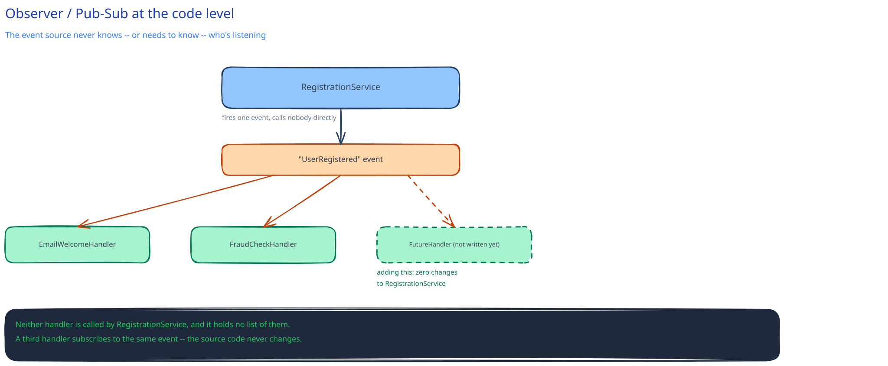

# Design Patterns in System Design

A design pattern is a named solution to a recurring problem. The value in an interview isn't reciting the GoF catalog — it's recognizing the *shape* of a problem fast enough to reach for the right pattern instead of reinventing it under time pressure. This guide already uses three without ceremony in the [URL Shortener LLD](../../02-lld-fundamentals.md); this page names a few more that come up constantly at system-design scale specifically, not the general-OOP patterns (Singleton, Factory) that show up in any intro course.

## Strategy — recap

Already covered in the [URL Shortener's `KeyGenerator`](../../02-lld-fundamentals.md) and in [SOLID's Open/Closed section](solid-principles.md). The signal that means "reach for Strategy": several interchangeable *algorithms* for the same job — a rate-limiting algorithm, a cache eviction policy, a pricing rule — that need to swap without touching the caller.

## Observer / Pub-Sub, at the code level

Not the infrastructure-level version this guide's [Message Queues & Pub/Sub](../hld-building-blocks/message-queues-pubsub.md) page covers — this is the same idea inside one process. A component needs to react to an event without the event *source* knowing or caring who's listening. Concrete example: `UserRegistered` fires, and an `EmailWelcomeHandler` and a `FraudCheckHandler` both react to it — neither of which the registration code calls directly, or even knows exists. The win is concrete too: adding a third handler is zero changes to the registration code, because it was never coupled to a fixed list of things that happen next.

## Circuit Breaker, as a code-level wrapper

The concept is [already covered](../scalability-resilience/circuit-breakers-retries.md) — closed/open/half-open, failing fast to protect both sides of a call. At the code level it's usually a decorator/wrapper class around a callable dependency: the calling code invokes the wrapped method exactly as it always did, and doesn't know or care whether the breaker is currently open — it just gets a fast failure instead of a hung call when it is. The pattern is what makes the resilience concept a drop-in around existing calls instead of an if-check scattered through every caller.

## Builder, for the case it actually earns its place

Constructing an object with many optional parameters. Concrete symptom it fixes: a constructor with eight positional parameters, where callers constantly get the order wrong or pass `null` for five of them because most calls only care about two or three. A builder trades that for named, chainable calls (`.withRetries(3).withTimeout(500ms)`) and a single `.build()` — worth it exactly when a plain constructor's parameter list has become the actual bug source, not by default for every class with more than one field.

## The honest anti-pattern warning

Forcing a named pattern onto a problem that doesn't have that shape makes code *harder* to read, not easier — a pattern name should describe a problem you already recognize, not be a checklist applied on principle. This is the same caution [SOLID's caveat](solid-principles.md) makes about interfaces: the pattern earns its place, or it's indirection with no payoff.

## Interviewer follow-ups

**How do you explain the difference between Strategy and Decorator when both "wrap" behavior?**
Strategy swaps *which* algorithm runs — the implementations are alternatives to each other, and exactly one is active at a time. Decorator *adds* behavior around an existing implementation without replacing it — a circuit breaker wraps a real call and still ultimately makes it; it doesn't offer a different way to make the call.

**When would Observer be the wrong choice compared to just calling the handlers directly?**
When there are only ever going to be one or two fixed reactions to an event, and the order or return value of those calls actually matters to the caller — direct calls are simpler to trace and reason about than an indirection layer, and Observer's whole benefit (adding reactions without touching the source) doesn't pay for itself if new reactions basically never get added.

**How do you avoid over-engineering a solution by pattern-matching too early in an interview?**
Describe the concrete problem and let the interviewer hear you notice the shape ("this needs to swap algorithms at runtime, so Strategy") rather than announcing a pattern name up front and fitting the problem to it — naming the symptom first is also just more convincing than naming the solution first.
