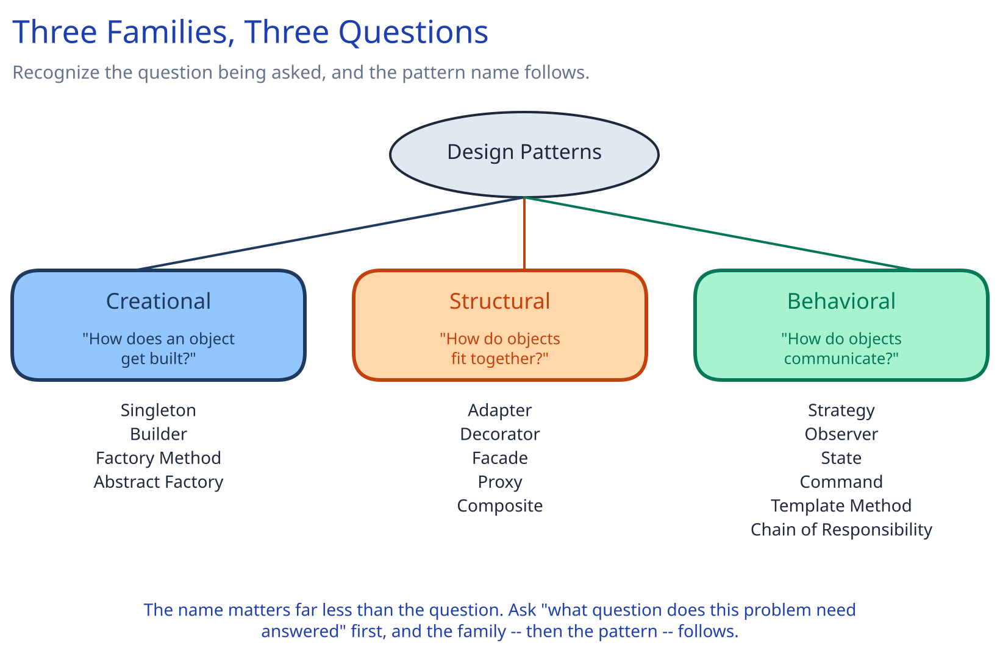

# Module 00 — Overview

## What a design pattern actually is

A design pattern is a named solution to a recurring *structural* problem — not a recurring business problem. It's the answer to "I've seen this shape before" at the level of classes and interfaces: how something gets constructed, how two incompatible pieces talk to each other, how one component reacts to another without being wired to it directly. The value in an interview isn't reciting the Gang of Four catalog — it's recognizing the *shape* of a problem fast enough to reach for the right pattern instead of reinventing it under time pressure, or worse, forcing a pattern onto a problem that doesn't have that shape.

This guide already uses several of these without ceremony throughout its case studies — the [URL Shortener's `KeyGenerator`](../../../01-hld-fundamentals.md) is Strategy, the [Payments System's `PaymentStatus`](../../../content/case-studies/payments-system/02-lld.md) is a State machine, the [Distributed Job Scheduler's trigger event](../../../content/case-studies/distributed-job-scheduler/02-lld.md) is Command. This module names the full catalog explicitly, in one place, so the *name* is available to you the next time you notice the shape.

## The three families, and the one question each answers

Every classic pattern falls into one of three families, and each family exists to answer a different question:

- **Creational** — *how does an object get built?* These patterns exist because "call the constructor" stops being enough once construction itself has decisions in it: which concrete type to build, how to assemble something with many optional pieces, or how to guarantee only one instance exists.
- **Structural** — *how do objects fit together?* These patterns exist to compose objects and classes into larger structures without those structures becoming rigid — wrapping an incompatible interface, adding behavior without subclassing, hiding a complex subsystem behind a simple one.
- **Behavioral** — *how do objects communicate and share responsibility?* These patterns exist to distribute behavior across objects — swapping an algorithm at runtime, reacting to an event without being wired to its source, modeling a lifecycle as explicit states instead of scattered booleans.

## Quick reference: symptom → pattern

This is the table worth actually memorizing — not the pattern names, the *symptoms* that should make each name come to mind:

| If you're looking at... | Reach for | Family |
|---|---|---|
| A constructor with 6+ parameters, most optional, callers get the order wrong | **Builder** | Creational |
| Code that decides *which subclass* to instantiate based on a type flag | **Factory Method** | Creational |
| You need a whole *family* of related objects that must stay consistent with each other (e.g. one cloud provider's client set) | **Abstract Factory** | Creational |
| Exactly one instance must exist system-wide (a config registry, a connection pool) | **Singleton** — and know its cost before reaching for it | Creational |
| Two components need to talk, but their interfaces don't match (a legacy SDK, a third-party API) | **Adapter** | Structural |
| You need to add behavior to an object without touching its class or subclassing it | **Decorator** | Structural |
| A complex subsystem (many classes) needs one simple entry point for callers | **Facade** | Structural |
| You need to control or defer access to a real object (lazy load, cache, permission check, remote call) | **Proxy** | Structural |
| Individual items and groups-of-items need to be treated identically by calling code | **Composite** | Structural |
| Several interchangeable *algorithms* solve the same job (pricing rule, rate-limit algorithm, key generator) | **Strategy** | Behavioral |
| A component needs to react to an event without the source knowing who's listening | **Observer** | Behavioral |
| An object's valid behavior/transitions depend entirely on which state it's currently in | **State** | Behavioral |
| A request needs to be queued, logged, retried, or undone as a first-class object | **Command** | Behavioral |
| Several variants of an algorithm share the same skeleton but differ in one or two steps | **Template Method** | Behavioral |
| A request should pass through a sequence of independent handlers, each deciding to handle it or pass it on | **Chain of Responsibility** | Behavioral |

## The honest anti-pattern warning

Forcing a named pattern onto a problem that doesn't have that shape makes code *harder* to read, not easier — a pattern name should describe a problem you already recognize, not be a checklist applied on principle. An interface with exactly one implementation that will only ever have one implementation is indirection with no payoff, the same caution this guide's [SOLID Principles](../solid-principles.md) page makes about interfaces generally. In an interview, describe the concrete symptom and let the interviewer hear you *notice* the shape ("this needs to swap algorithms at runtime, so Strategy") rather than announcing a pattern name up front and fitting the problem to it afterward.

## What's ahead

Module 01 covers Creational patterns, Module 02 covers Structural, Module 03 covers Behavioral. Each pattern gets the same treatment: the exact symptom it fixes, a class diagram, concrete pseudocode, a real system-design use case (tied to this guide's own case studies wherever one already exists), and an explicit note on when it's *not* worth it.
