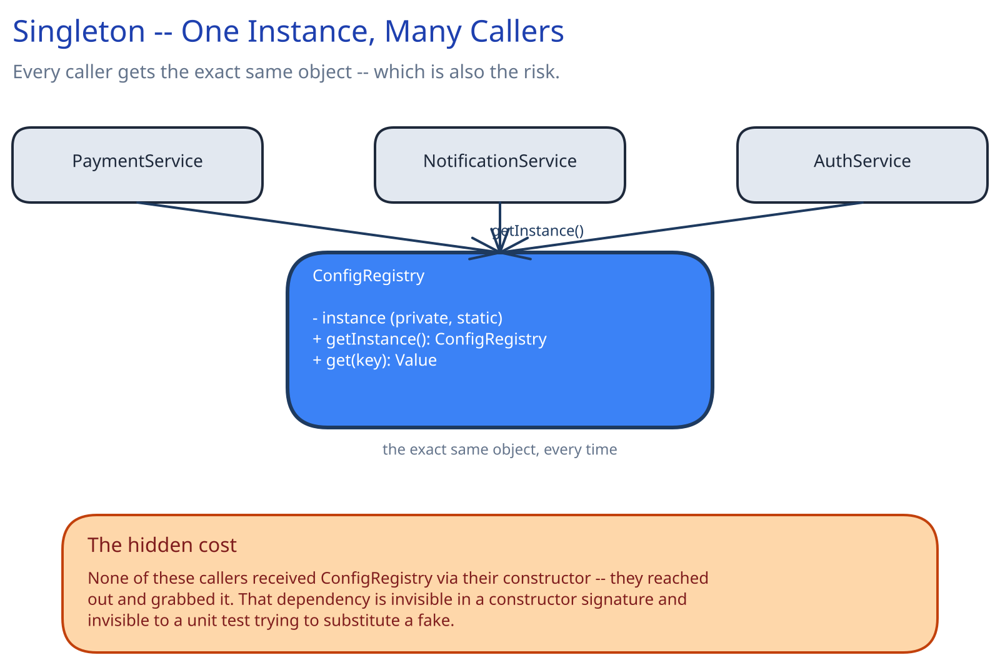
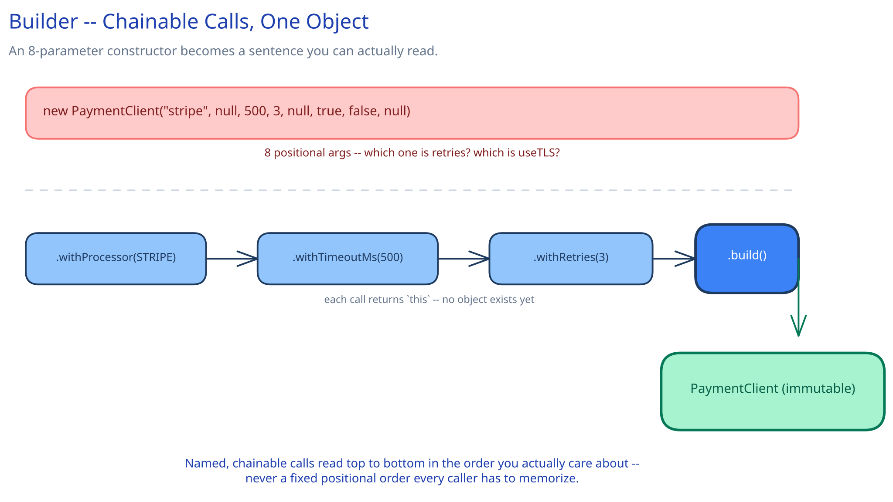
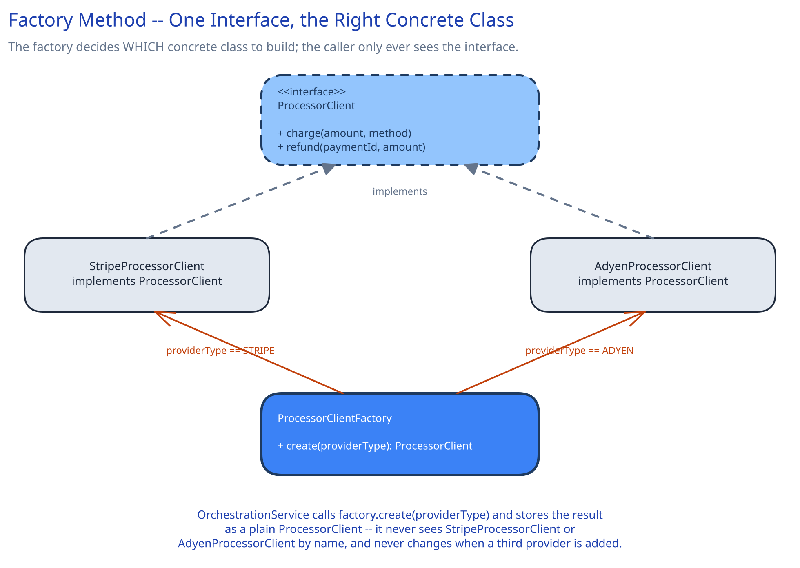
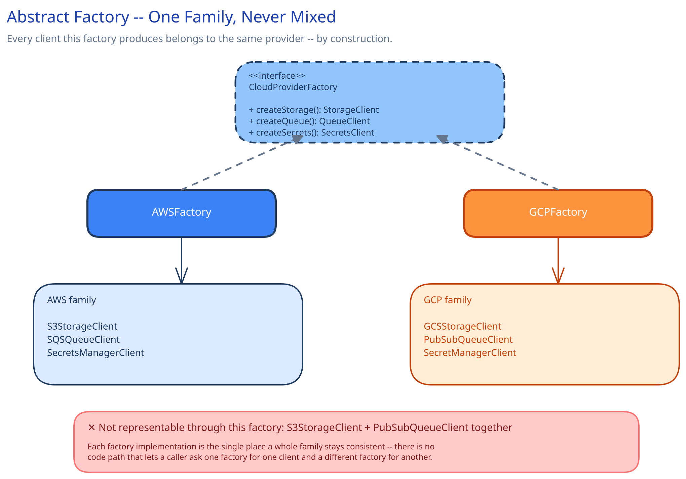

# Module 01 — Creational Patterns

Creational patterns answer one question: *how does an object get built?* Each one exists because "call the constructor" stops being enough once construction itself carries a decision — which concrete type to build, how to assemble something with many optional pieces, or how to guarantee only one instance exists system-wide.

## Singleton

**The exact symptom it fixes:** several unrelated parts of a codebase all need the *same* shared object — a config registry, a connection pool — and passing it explicitly through every constructor down the call chain feels like unnecessary ceremony for something that's "obviously" global. Singleton makes exactly one instance reachable from anywhere via a static accessor.



```
class ConfigRegistry:
    _instance: ConfigRegistry = None      # private, static

    static getInstance() -> ConfigRegistry:
        if _instance is None:
            _instance = ConfigRegistry(loadFromDisk())
        return _instance

    get(key) -> Value:
        return self.values[key]

# anywhere in the codebase, no constructor call in sight:
class PaymentService:
    charge(...):
        timeout = ConfigRegistry.getInstance().get("payment.timeout_ms")
```

**Real use case:** a config registry or a connection pool that genuinely must be one shared instance — opening a second database connection pool per request would exhaust connections, and two independently-loaded copies of configuration could disagree with each other at runtime.

**The hidden cost — read this before reaching for Singleton by default:** none of `PaymentService`, `AuthService`, or `NotificationService` received `ConfigRegistry` through their constructor — they each reached out and grabbed it. That dependency is invisible in every one of their constructor signatures, and invisible to a unit test trying to substitute a fake: a test of `PaymentService` now has to know that it secretly depends on `ConfigRegistry.getInstance()`, and either accept the real global state or resort to monkeypatching a static method. The strictly better version of this same idea, in almost every case, is **dependency injection**: pass one shared instance into each constructor explicitly, and let the composition root (wherever the app wires its objects together at startup) be the only place that decides it's shared. The object is still a singleton *in practice* — there's still only one instance — but the dependency is visible and swappable in tests. Reach for the static-accessor version of Singleton specifically only when there's no composition root available to do that wiring (a static utility library, for instance), not as a default way to share an object.

**When it's not worth it:** almost always prefer passing the shared instance explicitly (dependency injection) over a static accessor — the accessor version earns its place only when there is truly no reasonable way to inject the dependency instead.

## Builder

**The exact symptom it fixes:** a constructor with 6+ parameters, most of them optional, where callers constantly get the order wrong or pass `null` for the four they don't care about. `new PaymentClient("stripe", null, 500, 3, null, true, false, null)` is not reviewable — nobody can tell which positional argument is the timeout without opening the class definition.



```
class PaymentClientBuilder:
    _processor: string
    _timeoutMs: int = 1000        # sensible defaults live here, not repeated at every call site
    _retries: int = 0

    withProcessor(name) -> PaymentClientBuilder:
        self._processor = name
        return self                # returns `this` -- no object exists yet, just accumulated state

    withTimeoutMs(ms) -> PaymentClientBuilder:
        self._timeoutMs = ms
        return self

    withRetries(n) -> PaymentClientBuilder:
        self._retries = n
        return self

    build() -> PaymentClient:
        if self._processor is None:
            raise InvalidBuilderStateException("processor is required")
        return PaymentClient(self._processor, self._timeoutMs, self._retries)   # immutable once built

# the call site:
client = PaymentClientBuilder()
    .withProcessor("stripe")
    .withTimeoutMs(500)
    .withRetries(3)
    .build()
```

**Real use case:** any client configuration object with several optional knobs — a `PaymentClient`, an HTTP client, a queue consumer — where named, chainable calls read top to bottom in the order the *caller* actually cares about, never a fixed positional order every caller has to memorize or look up.

**When it's not worth it:** a class with two or three parameters, all required, doesn't need a builder — a plain constructor call is already perfectly readable, and a builder there is indirection with no payoff.

## Factory Method

**The exact symptom it fixes:** code needs to decide *which concrete class to instantiate* based on a runtime value (a config flag, a merchant's chosen provider) — and that decision, if inlined as an `if/else` or `switch` at every call site that needs a new instance, gets duplicated and drifts out of sync the moment a third option is added.



```
class ProcessorClientFactory:
    create(providerType) -> ProcessorClient:
        if providerType == "STRIPE":
            return StripeProcessorClient(stripeConfig)
        if providerType == "ADYEN":
            return AdyenProcessorClient(adyenConfig)
        raise UnknownProviderException(providerType)

# OrchestrationService never sees a concrete class name:
class OrchestrationService:
    processorFactory: ProcessorClientFactory

    charge(merchant, amount, ...):
        client = self.processorFactory.create(merchant.providerType)   # a plain ProcessorClient from here on
        return client.charge(amount, ...)
```

**Real use case:** this is exactly what a `ProcessorClientFactory` in front of this guide's [Payments System](../../case-studies/payments-system/02-lld.md) would do — decide, from a merchant's configured `providerType`, whether to construct a `StripeProcessorClient` or an `AdyenProcessorClient`. Worth naming the distinction from Strategy (Behavioral tab) explicitly, since both involve the same `ProcessorClient` interface: **Factory Method decides which concrete implementation to construct in the first place**; **Strategy is about the interface itself being swappable at the call site**, regardless of how the concrete instance behind it got there. They compose naturally — a factory constructs the right strategy for a given input — but they answer different questions.

**When it's not worth it:** if there's only ever going to be one concrete implementation, with no realistic second one on the horizon, a factory is a layer of indirection standing in for a constructor call — just construct the one class directly.

## Abstract Factory

**The exact symptom it fixes:** a system needs a *family* of related objects that must all agree with each other — mixing a storage client from one provider with a queue client from a different provider is either a bug or an unsupported configuration, and nothing in a plain factory-per-object design stops a caller from doing exactly that by accident.



```
interface CloudProviderFactory:
    createStorage() -> StorageClient
    createQueue() -> QueueClient
    createSecrets() -> SecretsClient

class AWSFactory implements CloudProviderFactory:
    createStorage(): return S3StorageClient(awsConfig)
    createQueue():   return SQSQueueClient(awsConfig)
    createSecrets(): return SecretsManagerClient(awsConfig)

class GCPFactory implements CloudProviderFactory:
    createStorage(): return GCSStorageClient(gcpConfig)
    createQueue():   return PubSubQueueClient(gcpConfig)
    createSecrets(): return SecretManagerClient(gcpConfig)

# the composition root picks ONE factory for the whole app -- never one method from each:
factory: CloudProviderFactory = AWSFactory() if config.provider == "aws" else GCPFactory()
storage = factory.createStorage()
queue = factory.createQueue()
```

**Real use case:** a service deployed across multiple clouds, where every dependency it touches (blob storage, a queue, a secrets manager) has to come from the *same* provider for a given deployment — `S3StorageClient` paired with `PubSubQueueClient` isn't just unusual, it's not a configuration this system is built to support, and Abstract Factory makes that combination structurally unrepresentable rather than a runtime validation check.

**When it's not worth it:** if the objects being constructed don't actually need to agree with each other — nothing breaks if one is AWS and another is GCP — this is over-engineering; reach for a plain Factory Method per object instead, one per family member, with no umbrella interface tying them together.
