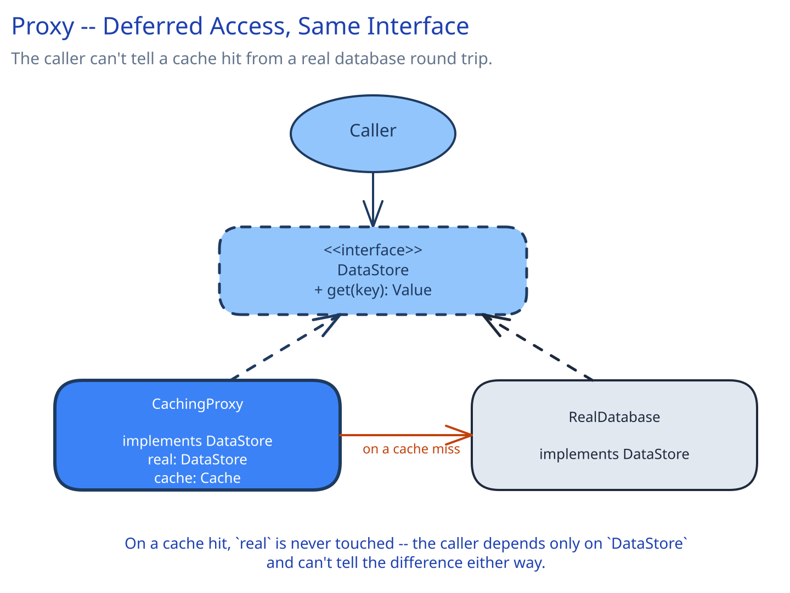
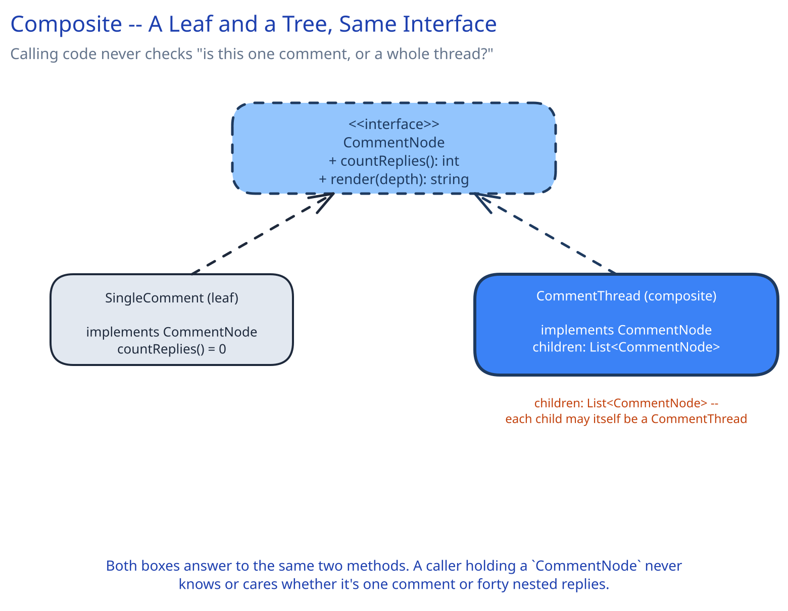

# Module 02 — Structural Patterns

Structural patterns answer one question: *how do objects fit together?* Each one composes existing pieces into a larger structure without making that structure rigid — wrapping an incompatible interface, adding behavior without subclassing, hiding a complex subsystem behind one simple entry point.

## Adapter

**The exact symptom it fixes:** your code depends on an interface it defined, and a dependency you don't control — an external SDK, a legacy service — exposes a *different* shape: different method names, different parameter units, a different response format. Rewriting every caller to match the dependency's actual shape ripples through the codebase every time you add a second dependency with yet another shape. Adapter instead writes one small class that implements your interface and translates to the external one internally — the rest of the codebase never sees the mismatch.


```
interface ProcessorClient:
    charge(amount, currency, method, idempotencyKey) -> ChargeResult
    refund(paymentId, amount, idempotencyKey) -> RefundResult

class StripeAdapter implements ProcessorClient:
    stripeSDK: StripeSDK   # the real, external library -- its shape is not ours to control

    charge(amount, currency, method, idempotencyKey):
        response = stripeSDK.createCharge(
            amount_cents = amount * 100,          # Stripe wants integer cents, we use decimal amounts
            currency = currency.lower(),          # Stripe wants lowercase currency codes
            source = method.token,
            idempotency_key = idempotencyKey)
        return ChargeResult(
            ok = response.status == "succeeded",
            processorRef = response.id)

class AdyenAdapter implements ProcessorClient:
    adyenSDK: AdyenSDK     # a completely different shape from Stripe's

    charge(amount, currency, method, idempotencyKey):
        response = adyenSDK.payments.submit(
            amount = {"value": amount * 100, "currency": currency.upper()},  # Adyen wants a nested object, uppercase currency
            paymentMethod = method.toAdyenFormat(),
            reference = idempotencyKey)
        return ChargeResult(
            ok = response.resultCode == "Authorised",   # a totally different success signal than Stripe's
            processorRef = response.pspReference)
```

**Real use case:** this is exactly what [Payments System's LLD](../../case-studies/payments-system/02-lld.md) does with `ProcessorClient` — `StripeAdapter` and `AdyenAdapter` (named `StripeProcessorClient`/`AdyenProcessorClient` there) each translate one external processor's actual request/response shape into the one shape `OrchestrationService` depends on. Worth naming the distinction from Factory Method (Creational tab) explicitly: Adapter makes an *existing, incompatible* interface fit; Factory Method decides *which* concrete implementation to construct in the first place. They often appear together — a factory constructs the right adapter for a given merchant's configured processor — but they solve different problems.

**When it's not worth it:** if you control both sides of the interface and there's no external shape to translate, an adapter is just an extra layer around a rename — change the interface or the caller directly instead.

## Decorator

**The exact symptom it fixes:** you need to add behavior around an existing call — retrying, circuit-breaking, rate-limiting, logging — without modifying the class that makes the call, and ideally without the caller even knowing the behavior was added. Subclassing doesn't compose: if you need retry *and* circuit-breaking *and* rate-limiting on the same call, subclassing forces one fixed combination baked into a single class hierarchy. Decorator lets each concern be its own small wrapper, stacked in whatever order the situation needs.


```
interface RequestHandler:
    handle(request) -> Response

class RealHandler implements RequestHandler:
    handle(request):
        return callDownstream(request)          # the actual work

class CircuitBreakerDecorator implements RequestHandler:
    wrapped: RequestHandler
    breaker: CircuitBreakerState

    handle(request):
        if breaker.isOpen():
            raise CircuitOpenException           # fails fast, never calls wrapped at all
        try:
            response = wrapped.handle(request)
            breaker.recordSuccess()
            return response
        except TransientError:
            breaker.recordFailure()
            raise

class RateLimiterDecorator implements RequestHandler:
    wrapped: RequestHandler
    limiter: TokenBucket

    handle(request):
        if not limiter.tryConsume():
            raise RateLimitExceeded
        return wrapped.handle(request)

# composed at startup, order matters:
handler = RateLimiterDecorator(CircuitBreakerDecorator(RealHandler()))
```

Notice the caller of `handler.handle(request)` never changes regardless of how many decorators are stacked — that's the entire payoff. `RateLimiterDecorator` rejects the request before the circuit breaker or the real call ever run, and each layer only knows about the interface it wraps, not what's inside it.

**Real use case:** the `RateLimiter` wrapping `UrlShortenerController` in this guide's [URL Shortener LLD](../../../02-lld-fundamentals.md); and [Circuit Breakers & Retries](../../scalability-resilience/circuit-breakers-retries.md) describes the exact same shape applied specifically to resilience — a circuit breaker is a decorator whose added behavior is "fail fast instead of calling through when the dependency is unhealthy."

**When it's not worth it:** if there's only ever going to be one fixed piece of added behavior that will never need to be composed with others or swapped independently, a single wrapper class — or even inline code at the call site — is simpler than an interface plus a decorator class.

## Facade

**The exact symptom it fixes:** a client needs to accomplish one coherent task, but doing so means calling several subsystems in a specific order, each with its own quirks (auth here, a different retry policy there, a response shape that needs reshaping before the next call can use it). Without a facade, every caller either duplicates that orchestration or copy-pastes it — and every subsystem's internal API is now something every client has to know about directly.


```
class CheckoutFacade:
    authService: AuthService
    inventoryService: InventoryService
    paymentService: PaymentService
    notificationService: NotificationService

    placeOrder(userId, cartId):
        user = authService.validate(userId)
        reservation = inventoryService.reserve(cartId)          # holds stock for the checkout window
        payment = paymentService.charge(user, reservation.total)
        notificationService.sendConfirmation(user, payment)
        return OrderConfirmation(payment.id, reservation.items)
```

The client calls exactly one method, `placeOrder()`. It never learns that four separate subsystems exist, in what order they're called, or that `inventoryService.reserve()` has to happen *before* `paymentService.charge()` (charging first and finding out the item is gone afterward would need a refund; the facade's ordering makes that mistake structurally impossible for a caller to make).

**Real use case:** this guide's own [API Gateway](../../hld-building-blocks/api-gateway.md) is a facade at the HLD layer — the backend-for-frontend aggregation it describes (combining two backend calls into one client-facing response) is exactly `CheckoutFacade` above, just drawn as a network boundary instead of an in-process class.

**When it's not worth it:** if the "subsystem" is actually one class with one method, a facade is a pointless extra hop — it earns its place only when it's genuinely collapsing multiple real calls, in a real order, into one.

## Proxy

**The exact symptom it fixes:** you need to control or defer access to a real object, without the caller changing how it calls it. Three common flavors of the same shape: a **caching proxy** answers from a cache before ever reaching the real object; a **virtual proxy** defers an expensive real object's construction until it's actually needed; a **protection proxy** checks permissions before delegating. All three implement the same interface as the real object and decide, per call, whether to actually reach it.



```
interface DataStore:
    get(key) -> Value

class RealDatabase implements DataStore:
    get(key):
        return runQuery(key)                     # a real, slow round trip

class CachingProxy implements DataStore:
    real: DataStore
    cache: Cache

    get(key):
        cached = cache.get(key)
        if cached is not None:
            return cached                        # real is never touched on a hit
        value = real.get(key)
        cache.set(key, value, ttl = 60)
        return value                              # caller can't tell this came from a miss
```

**Real use case:** this is the exact method a cache-aside layer implements — this guide's [Caching Strategies](../../hld-building-blocks/caching-strategies.md) page names the pattern by its caching behavior; here it's named by its structural shape. A [CDN](../../hld-building-blocks/cdn.md) is the same pattern operating at global edge scale: every edge PoP is a caching proxy sitting in front of an origin the client never addresses directly. Worth distinguishing from a protection proxy: same structural shape (implements the real object's interface, decides whether to delegate), but the decision is "is this caller allowed," not "do I already have this cached" — different question, identical class diagram.

**When it's not worth it:** if the caller is fine calling the cache and the real store as two separate, explicit steps, forcing both behind one interface adds a layer with no behavior payoff — Proxy earns its place specifically when the caller must not be able to tell the difference.

## Composite

**The exact symptom it fixes:** individual items and groups-of-items need to be treated identically by calling code. Without this pattern, every piece of code that walks the structure has to special-case "is this one item, or a collection of them?" — and that check gets duplicated at every call site that touches the structure.



```
interface CommentNode:
    countReplies() -> int
    render(depth) -> string

class SingleComment implements CommentNode:
    author: string
    text: string

    countReplies():
        return 0
    render(depth):
        return indent(depth) + author + ": " + text

class CommentThread implements CommentNode:
    root: SingleComment
    children: List[CommentNode]        # each child can itself be a CommentThread -- that's the recursion

    countReplies():
        return len(children) + sum(child.countReplies() for child in children)
    render(depth):
        lines = [root.render(depth)]
        for child in children:
            lines.append(child.render(depth + 1))
        return "\n".join(lines)
```

Calling code that wants a reply count or a rendered thread calls `countReplies()` or `render()` on whatever `CommentNode` it has — it never checks "is this a leaf or a thread" first. A single top-level comment and a thread with 40 nested replies look identical to the caller.

**Real use case:** a nested comment thread (any social platform's comment section — a reply can itself have replies, to arbitrary depth) or a file-system directory tree (a file and a folder both answer `size()`, a folder's just sums its children's).

**When it's not worth it:** if the structure never actually nests — it's always a flat list, never a group of groups — Composite adds recursive machinery for a shape that doesn't recur. A plain list and a loop is simpler and says exactly what's happening.
