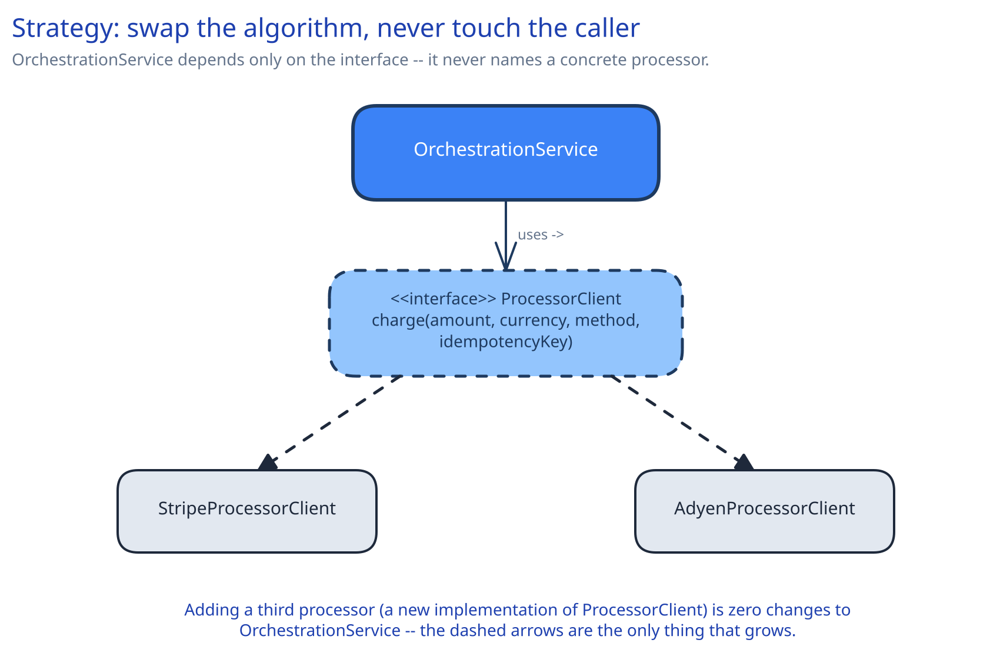
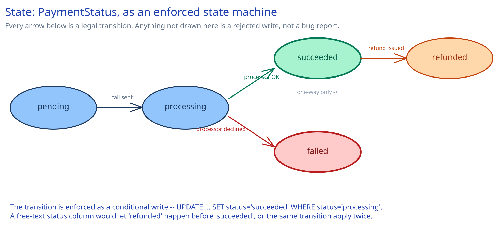
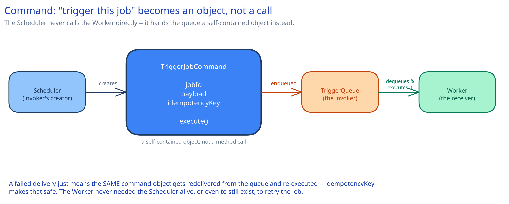
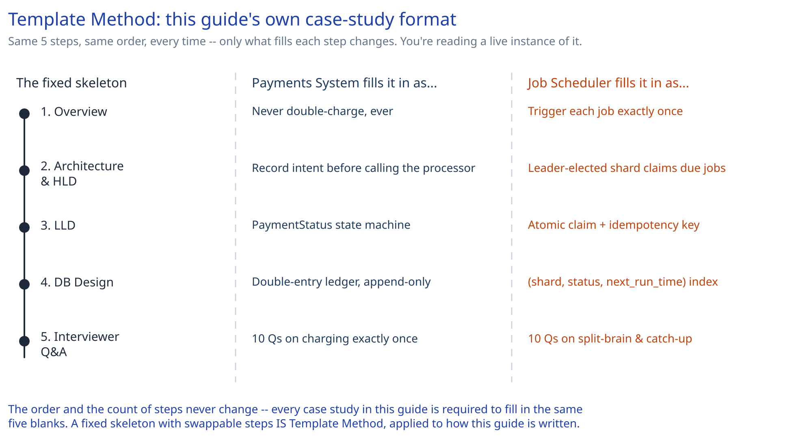
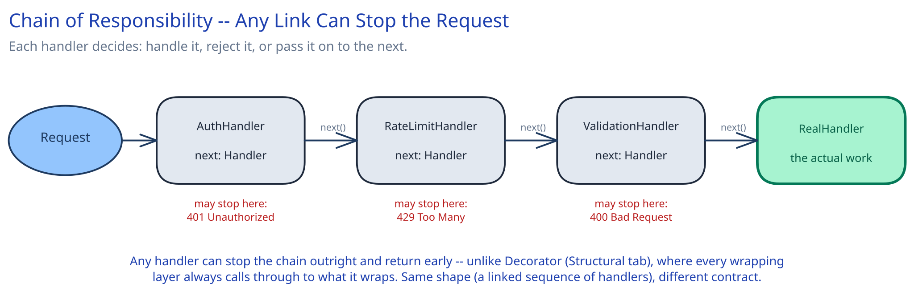

# Module 03 — Behavioral Patterns

Behavioral patterns answer one question: *how do objects communicate and share responsibility?* Each one distributes behavior across objects rather than concentrating it in one place — swapping an algorithm at runtime, reacting to an event without being wired to its source, modeling a lifecycle as explicit states instead of scattered booleans.

## Strategy

**The exact symptom it fixes:** several interchangeable *algorithms* solve the same job — a rate-limiting algorithm, a pricing rule, a payment processor call — and the caller shouldn't need to change when a new one is added or the active one is swapped.



This is already used constantly across this guide — the [URL Shortener's `KeyGenerator`](../../../02-lld-fundamentals.md) (base62-from-counter is one strategy; hash-and-truncate is a valid alternative behind the same interface) and this guide's [Distributed Rate Limiter](../../case-studies/distributed-rate-limiter/02-lld.md) (`TokenBucketRateLimiter`/`SlidingWindowRateLimiter`, interchangeable behind one `RateLimiter` interface) are both this pattern. The shape is always the same:

```
interface ProcessorClient:
    charge(amount, currency, method, idempotencyKey) -> ChargeResult

class OrchestrationService:
    processor: ProcessorClient       # depends on the interface, never a concrete class

    charge(amount, currency, method, idempotencyKey):
        return self.processor.charge(amount, currency, method, idempotencyKey)
```

Adding a third processor (a new class implementing `ProcessorClient`) is zero changes to `OrchestrationService` — the only thing that grows is which concrete class gets constructed and handed in, which is Factory Method's job (Creational tab), not Strategy's.

**When it's not worth it:** if there's genuinely only ever going to be one algorithm, with no swapping and no realistic second implementation, the interface is pure ceremony — call the one implementation directly.

## Observer

**The exact symptom it fixes:** a component needs to react to an event without the event *source* knowing or caring who's listening, and the number of things that react needs to grow over time without the source changing.


```
interface EventHandler:
    handle(event) -> void

class UserRegistrationService:
    handlers: List[EventHandler]     # never a fixed, named list of "the two things that happen next"

    register(email, password):
        user = self.createUser(email, password)
        event = UserRegistered(user.id, user.email)
        for handler in self.handlers:
            handler.handle(event)    # fires the event; doesn't know or care what each handler does
        return user

class EmailWelcomeHandler implements EventHandler:
    handle(event):
        emailService.sendWelcome(event.email)

class FraudCheckHandler implements EventHandler:
    handle(event):
        fraudService.scoreNewAccount(event.id)
```

**Real use case:** `UserRegistered` firing both `EmailWelcomeHandler` and `FraudCheckHandler`, neither of which `UserRegistrationService` calls by name — adding a third handler (say, an analytics tracker) is zero changes to the registration code, because it was never coupled to a fixed list of things that happen next.

**When it's not worth it:** when there are only ever going to be one or two fixed reactions to an event, and the order or return value of those calls actually matters to the caller — direct calls are simpler to trace and reason about than an indirection layer, and Observer's whole benefit (adding reactions without touching the source) doesn't pay for itself if new reactions basically never get added.

## State

**The exact symptom it fixes:** an object's valid operations depend entirely on which phase of its lifecycle it's currently in, and modeling that with a free-text status field or a handful of booleans lets an invalid transition (or the same transition applied twice) slip through silently.



This guide's [Payments System's `PaymentStatus`](../../case-studies/payments-system/02-lld.md) is the canonical example already built out in depth: `pending → processing → succeeded | failed`, with `succeeded → refunded` as a separate, one-way transition.

```
enum PaymentStatus: pending, processing, succeeded, failed, refunded

# the transition is enforced as a conditional write, not an unconditional overwrite:
applied = paymentRepo.updateStatus(paymentId, from="processing", to="succeeded")
if not applied:
    # the row wasn't in "processing" -- this write is a no-op, not a silent corruption
    return
```

The payoff isn't the enum by itself — it's enforcing the transition *at the point of write* (`WHERE status = 'processing'`), so "refunded before succeeded" or the same transition applied twice by a retried request is a zero-row update, not a race the application has to detect after the fact.

**When it's not worth it:** an object with only two states and one transition between them doesn't need a named state machine — a single boolean says everything a `State` enum would, with less ceremony.

## Command

**The exact symptom it fixes:** a request needs to be queued, retried, logged, or replayed independently of whoever originally created it — which is impossible if "do the thing" is just a method call that executes immediately and leaves nothing behind.



This guide's [Distributed Job Scheduler](../../case-studies/distributed-job-scheduler/02-lld.md) encapsulating "trigger this job" as a first-class event — carrying its own `idempotencyKey`, queued, and executed by a worker pool that never talks to the Scheduler that created it — *is* this pattern, even though the LLD page never names it directly.

```
class TriggerJobCommand:
    jobId: string
    payload: object
    idempotencyKey: string       # job_id + the specific scheduled time it fired for

    execute():
        worker.run(self.jobId, self.payload, self.idempotencyKey)

# the Scheduler creates the command and hands it to a queue -- it never calls the Worker directly:
command = TriggerJobCommand(job.id, job.payload, f"{job.id}:{job.nextRunTime}")
triggerQueue.enqueue(command)

# a Worker dequeues and executes later, possibly on a different process entirely:
command = triggerQueue.dequeue()
command.execute()
```

A failed delivery just means the *same* command object gets redelivered from the queue and re-executed — `idempotencyKey` is what makes that safe. The Worker never needed the Scheduler to still be running, or even to still exist, to retry the job.

**When it's not worth it:** if a request always executes synchronously and immediately, with no need to queue, log, or undo it later, wrapping it in a command object adds a class with no behavior the direct method call didn't already have.

## Template Method

**The exact symptom it fixes:** several variants of a process share the same fixed sequence of steps, but differ in what fills in one or two of those steps — and without this pattern, each variant either copy-pastes the whole sequence (drifting out of sync over time) or the shared steps get duplicated across every variant.



The genuinely useful example here is a meta one: **you are reading a live instance of Template Method right now.** Every case study in this guide fills in the exact same five-step skeleton — Overview, Architecture & HLD, LLD, DB Design, Interviewer Q&A — in the exact same order, every time. The [Payments System](../../case-studies/payments-system/00-overview.md) fills "LLD" with a `PaymentStatus` state machine; the [Distributed Job Scheduler](../../case-studies/distributed-job-scheduler/00-overview.md) fills the identical slot with an atomic claim and an idempotency key. The skeleton — the number and order of steps — never changes; only what fills each step does.

```
abstract class CaseStudyOutline:
    # the fixed skeleton -- final, no subclass ever reorders or skips a step
    final write():
        writeOverview()
        writeArchitectureAndHLD()
        writeLLD()
        writeDbDesign()
        writeInterviewerQnA()

    # each concrete case study fills in every step differently
    abstract writeOverview()
    abstract writeArchitectureAndHLD()
    abstract writeLLD()
    abstract writeDbDesign()
    abstract writeInterviewerQnA()

class PaymentsSystemOutline extends CaseStudyOutline:
    writeLLD():
        describeStateMachine("pending -> processing -> succeeded | failed")
    # ... the other four steps, filled in differently than every other case study
```

**When it's not worth it:** if the "shared skeleton" is actually only followed by one concrete case today, with no second variant in sight, this is premature structure — write the one sequence directly and extract the template only once a second, genuinely similar variant shows up.

## Chain of Responsibility

**The exact symptom it fixes:** a request should pass through a sequence of independent checks or handlers — auth, then rate limiting, then validation — where any one of them might need to reject the request outright, and adding a new check shouldn't mean editing a growing `if/else` block that already knows about every other check.



```
interface Handler:
    handle(request) -> Response

class AuthHandler implements Handler:
    next: Handler
    handle(request):
        if not isAuthenticated(request):
            return Response(401)          # stops the chain outright -- next is never called
        return self.next.handle(request)

class RateLimitHandler implements Handler:
    next: Handler
    handle(request):
        if not limiter.tryConsume(request.clientId):
            return Response(429)
        return self.next.handle(request)

# composed once, at startup:
chain = AuthHandler(next = RateLimitHandler(next = ValidationHandler(next = RealHandler())))
```

**Real use case:** a middleware pipeline in front of any request handler — connect this to [Rate Limiting](../../hld-building-blocks/rate-limiting.md) and the `RateLimiter` already named elsewhere in this topic. Worth naming the distinction from Decorator (Structural tab) explicitly, since both look like a linked sequence of wrappers: **any handler in a Chain of Responsibility can stop the request outright and never call the next one**; **every layer of a Decorator always calls through to what it wraps** — a rate-limiting decorator still ultimately makes the call it wraps (or raises), while a rate-limiting *handler* in a chain can simply end the chain there. Same-looking structure, different contract.

**When it's not worth it:** if the set of checks is small, fixed, and never reordered or extended, a plain sequence of `if` statements in one function is more readable than a chain of handler objects — the pattern earns its place specifically when handlers need to be added, removed, or reordered independently.
