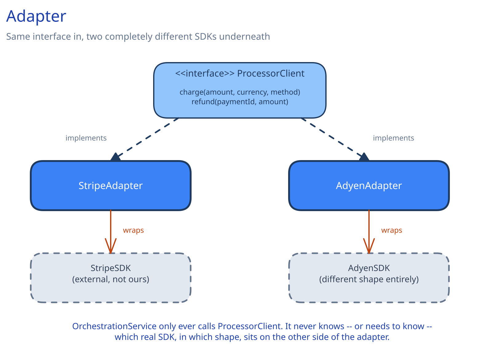

# Adapter



## The Problem It Solves

Your code depends on an interface it defined, and a dependency you don't control — an external SDK, a legacy service — exposes a *different* shape: different method names, different parameter units, a different response format. Rewriting every caller to match the dependency's actual shape ripples through the codebase every time you add a second dependency with yet another shape.

## How It Works

One small class implements the interface your code already depends on, and internally translates each call into whatever the external dependency actually expects — different parameter units, a different method name, a differently-shaped response. The rest of the codebase never sees the mismatch; it only ever calls the interface it already knows.

## Implementation

```
interface ProcessorClient:
    charge(amount, currency, method, idempotencyKey) -> ChargeResult
    refund(paymentId, amount, idempotencyKey) -> RefundResult

class StripeAdapter implements ProcessorClient:
    stripeSDK: StripeSDK   # the real, external library -- its shape is not ours to control

    charge(amount, currency, method, idempotencyKey):
        response = stripeSDK.createCharge(
            amount_cents = amount * 100,          # Stripe wants integer cents, we use decimal amounts
            currency = currency.lower(),          # Stripe wants lowercase currency codes
            source = method.token,
            idempotency_key = idempotencyKey)
        return ChargeResult(
            ok = response.status == "succeeded",
            processorRef = response.id)

class AdyenAdapter implements ProcessorClient:
    adyenSDK: AdyenSDK     # a completely different shape from Stripe's

    charge(amount, currency, method, idempotencyKey):
        response = adyenSDK.payments.submit(
            amount = {"value": amount * 100, "currency": currency.upper()},  # Adyen wants a nested object, uppercase currency
            paymentMethod = method.toAdyenFormat(),
            reference = idempotencyKey)
        return ChargeResult(
            ok = response.resultCode == "Authorised",   # a totally different success signal than Stripe's
            processorRef = response.pspReference)
```

## Real-World Use Case

This is exactly what [Payments System's LLD](../../case-studies/payments-system/02-lld.md) does with `ProcessorClient` — `StripeAdapter` and `AdyenAdapter` (named `StripeProcessorClient`/`AdyenProcessorClient` there) each translate one external processor's actual request/response shape into the one shape `OrchestrationService` depends on. Neither adapter's internal unit conversions, field renames, or success-signal differences ever leak past its own class boundary.

## When to Use It

- Your code already has (or should have) its own interface, and an external dependency's shape doesn't match it.
- You need to support two or more external dependencies with genuinely different shapes behind that one interface.
- You don't control the external dependency's API and can't simply change it to match yours.

## When NOT to Use It

If you control both sides of the interface and there's no external shape to translate, an adapter is just an extra layer around a rename — change the interface or the caller directly instead of adding a class whose only job is renaming fields.

## Related Patterns

Adapter and [Factory Method](03-factory-method.md) often appear together — a factory decides *which* adapter to construct for a given configuration, while each adapter handles the *translation* once constructed. Adapter is also easy to confuse with [Facade](07-facade.md): Adapter makes one existing, incompatible interface fit; Facade collapses several real subsystems, called in a specific order, into one simple entry point.
