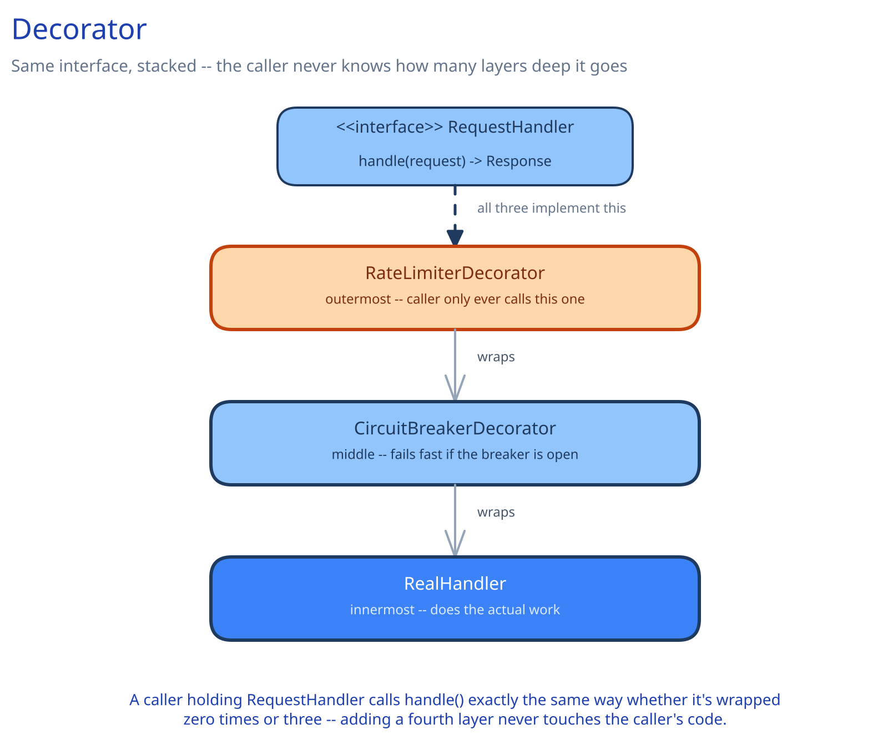

# Decorator



## The Problem It Solves

You need to add behavior around an existing call — retrying, circuit-breaking, rate-limiting, logging — without modifying the class that makes the call, and ideally without the caller even knowing the behavior was added. Subclassing doesn't compose: if you need retry *and* circuit-breaking *and* rate-limiting on the same call, subclassing forces one fixed combination baked into a single class hierarchy, with a new subclass needed for every combination you might want.

## How It Works

Each decorator implements the exact same interface as what it wraps, holds a reference to the wrapped instance, and adds its own behavior before and/or after delegating to it. Because every decorator (and the real object underneath) share one interface, they stack in any order and any number, and the caller holds only that shared interface — never aware how many layers, if any, sit underneath.

## Implementation

```
interface RequestHandler:
    handle(request) -> Response

class RealHandler implements RequestHandler:
    handle(request):
        return callDownstream(request)          # the actual work

class CircuitBreakerDecorator implements RequestHandler:
    wrapped: RequestHandler
    breaker: CircuitBreakerState

    handle(request):
        if breaker.isOpen():
            raise CircuitOpenException           # fails fast, never calls wrapped at all
        try:
            response = wrapped.handle(request)
            breaker.recordSuccess()
            return response
        except TransientError:
            breaker.recordFailure()
            raise

class RateLimiterDecorator implements RequestHandler:
    wrapped: RequestHandler
    limiter: TokenBucket

    handle(request):
        if not limiter.tryConsume():
            raise RateLimitExceeded
        return wrapped.handle(request)

# composed at startup, order matters:
handler = RateLimiterDecorator(CircuitBreakerDecorator(RealHandler()))
```

Notice the caller of `handler.handle(request)` never changes regardless of how many decorators are stacked — that's the entire payoff. `RateLimiterDecorator` rejects the request before the circuit breaker or the real call ever run, and each layer only knows about the interface it wraps, not what's inside it.

## Real-World Use Case

The `RateLimiter` wrapping `UrlShortenerController` in this guide's [URL Shortener LLD](../../../02-lld-fundamentals.md); and [Circuit Breakers & Retries](../../scalability-resilience/circuit-breakers-retries.md) describes the exact same shape applied specifically to resilience — a circuit breaker is a decorator whose added behavior is "fail fast instead of calling through when the dependency is unhealthy."

## When to Use It

- You need to add cross-cutting behavior (logging, retries, rate limiting, caching) around a call without changing the class that makes it.
- More than one such behavior might need to be combined, in varying combinations, without a subclass explosion.
- The caller should never need to know how many layers of added behavior currently exist.

## When NOT to Use It

If there's only ever going to be one fixed piece of added behavior that will never need to be composed with others or swapped independently, a single wrapper class — or even inline code at the call site — is simpler than an interface plus a decorator class.

## Related Patterns

Worth naming the distinction from [Chain of Responsibility](15-chain-of-responsibility.md) explicitly, since both look like a linked sequence of wrapping objects: any handler in a Chain of Responsibility can stop the request outright and never call the next one; every layer of a Decorator always calls through to what it wraps (or explicitly raises). Decorator is also structurally similar to [Proxy](08-proxy.md) — both implement the same interface as what they hold — but Proxy's job is deciding *whether* to delegate at all, while Decorator's job is *adding* behavior around a delegation that always happens.
