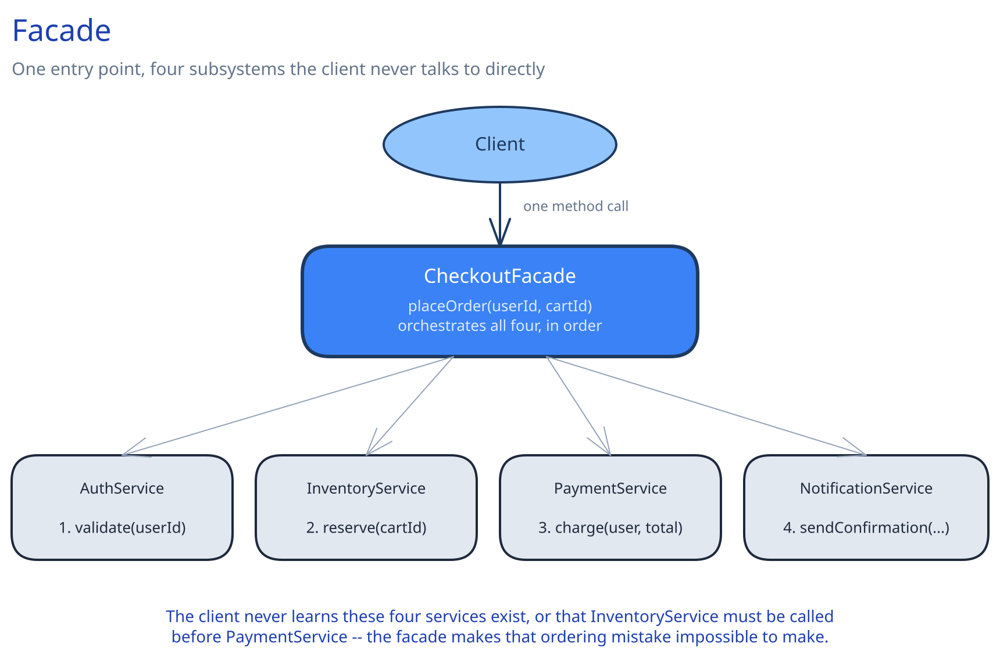

# Facade



## The Problem It Solves

A client needs to accomplish one coherent task, but doing so means calling several subsystems in a specific order, each with its own quirks (auth here, a different retry policy there, a response shape that needs reshaping before the next call can use it). Without a facade, every caller either duplicates that orchestration or copy-pastes it — and every subsystem's internal API is now something every client has to know about directly, including the correct call order.

## How It Works

One class exposes a small number of high-level methods, each of which internally calls several subsystems in the correct order and shape, and returns one simplified result. The client calls exactly one method and never learns that multiple subsystems exist behind it, in what order they run, or what any individual subsystem's own API looks like.

## Implementation

```
class CheckoutFacade:
    authService: AuthService
    inventoryService: InventoryService
    paymentService: PaymentService
    notificationService: NotificationService

    placeOrder(userId, cartId):
        user = authService.validate(userId)
        reservation = inventoryService.reserve(cartId)          # holds stock for the checkout window
        payment = paymentService.charge(user, reservation.total)
        notificationService.sendConfirmation(user, payment)
        return OrderConfirmation(payment.id, reservation.items)
```

The client calls exactly one method, `placeOrder()`. It never learns that four separate subsystems exist, in what order they're called, or that `inventoryService.reserve()` has to happen *before* `paymentService.charge()` — charging first and finding out the item is gone afterward would need a refund, and the facade's fixed ordering makes that mistake structurally impossible for a caller to make.

## Real-World Use Case

This guide's own [API Gateway](../../hld-building-blocks/api-gateway.md) is a facade at the HLD layer — the backend-for-frontend aggregation it describes (combining two backend calls into one client-facing response) is exactly `CheckoutFacade` above, just drawn as a network boundary instead of an in-process class.

## When to Use It

- A single logical operation genuinely requires calling multiple subsystems in a specific order.
- Callers currently duplicate that orchestration, or would have to learn several subsystems' individual APIs just to accomplish one task.
- You want the *correct order* of operations to be structurally guaranteed, not just documented and hoped for.

## When NOT to Use It

If the "subsystem" is actually one class with one method, a facade is a pointless extra hop — it earns its place only when it's genuinely collapsing multiple real calls, in a real order, into one.

## Related Patterns

Facade is easy to confuse with [Adapter](05-adapter.md): Adapter makes one existing, incompatible interface fit what your code expects; Facade simplifies access to several real, compatible subsystems by hiding their orchestration. A facade can internally use adapters for any subsystem whose shape doesn't already match, but the two solve different problems.
