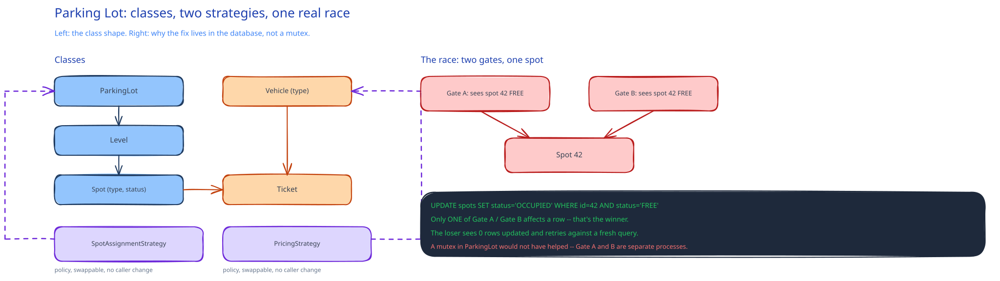

# LLD Worked Example: Parking Lot System



A parking lot is a classic LLD prompt precisely because it's small enough to finish in an interview, but it still forces the same decisions as a much bigger system: modeling a small type hierarchy, picking where a strategy belongs, and handling one real concurrency race. This guide's [Practice Problems](../../04-practice-problems.md) module already flags parking lot as a "smaller-scale, LLD-and-DB-heavy" problem for exactly this reason — this page works through it.

## The entities

- **`ParkingLot`** — owns a list of `Level`s. The entry point for "is there a spot," "assign one," "process exit."
- **`Level`** — owns a list of `Spot`s, each with a `SpotType` (`MOTORCYCLE`, `COMPACT`, `LARGE`).
- **`Vehicle`** — has a `VehicleType` that constrains which `SpotType`s it can use (a motorcycle can use any spot; a bus can only use `LARGE`).
- **`Ticket`** — created on entry, holds the vehicle, the assigned spot, and the entry timestamp; closed on exit with an exit timestamp and computed fee.

## Two decisions that are Strategy, not special cases

**Spot assignment** — "nearest available" vs. "compact-first to save large spots for large vehicles" are both valid policies behind one `SpotAssignmentStrategy` interface with one method, `assign(vehicle, level) -> Spot`. Picking a policy is a config choice, not a rewrite.

**Pricing** — hourly flat rate, a per-vehicle-type rate table, or a progressive rate (more expensive per hour the longer you stay) are all a `PricingStrategy` interface with one method, `computeFee(ticket) -> Amount`. This is the exact shape [SOLID's Open/Closed section](solid-principles.md) and [the Strategy pattern](design-patterns-in-system-design/10-strategy.md) both describe: swapping the policy shouldn't touch the class that calls it.

## The concurrency race, and where it's actually enforced

Two attendants (or two automated gates) can both query "is spot 42 free?", both see "yes," and both try to assign a car to it — a real race whenever assignment reads-then-writes without protection. The wrong fix is putting a mutex in the `ParkingLot` class and calling it solved: an in-process lock only protects against a race *within one process*, and does nothing if two gate processes run independently.

The right fix is the same one this guide names for every stateful resource elsewhere: enforce it at the resource itself. A spot's status change (`FREE -> OCCUPIED`) should be a single conditional database update — `UPDATE spots SET status='OCCUPIED' WHERE id=? AND status='FREE'` — and the assignment only succeeds if that update actually affected a row. The loser of the race gets zero rows updated, not a corrupted double-assignment, and the code re-queries for the next available spot instead. This is the database-level version of the optimistic check this guide's [Distributed Locks](../scalability-resilience/distributed-locks.md) page makes at the infrastructure level: the lock alone is never the safety net, the resource's own atomic check is.

## Pseudocode for the two calls that matter

```
ParkingLot.assignSpot(vehicle):
    level = findLevelWithCapacityFor(vehicle.type)
    spot = spotAssignmentStrategy.assign(vehicle, level)
    if spot is null:
        raise LotFullException

    claimed = spotRepository.claimIfFree(spot.id)   # the conditional UPDATE above
    if not claimed:
        return assignSpot(vehicle)                   # lost the race, retry against a fresh view

    ticket = Ticket.open(vehicle, spot, now())
    return ticket

ParkingLot.processExit(ticket):
    ticket.close(now())
    fee = pricingStrategy.computeFee(ticket)
    spotRepository.release(ticket.spot.id)            # FREE -> available again
    return fee
```

## Interviewer follow-ups

**How would you handle a vehicle that doesn't fit any remaining spot type?**
`LotFullException` (or a type-specific variant) rather than silently assigning an incompatible spot — the caller (the gate/kiosk) is responsible for turning that into a "lot full for your vehicle type" message, not the domain model.

**Where does the check "is this ticket already closed" belong, and why does it matter?**
On `Ticket.close()` itself, raising if it's already closed — without it, a double-tap on an exit kiosk could compute and charge the fee twice for the same stay, the same class of bug this guide's [Idempotency Keys](../scalability-resilience/idempotency-keys.md) page names for any operation that can be retried.

**How would you extend this for reserved/pre-paid spots?**
A `Reservation` entity separate from `Ticket`, and `SpotAssignmentStrategy.assign()` filtering out reserved spots for anyone but the reservation holder during its window — the interface doesn't change, only the strategy implementation gains one more input to consider.
