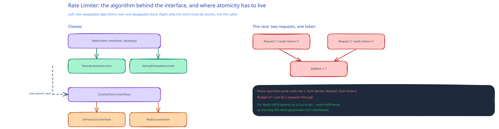

# LLD Worked Example: Rate Limiter



This guide's [Rate Limiting](../hld-building-blocks/rate-limiting.md) page covers the algorithms and where in the request path a limit gets enforced. This page is the class-level follow-through: what the interfaces actually look like, and — per that page's own flag — this is one of the few LLD problems where the *algorithm* choice belongs in the class design itself, not hidden behind a generic strategy name.

## The interfaces

- **`RateLimiter`** *(interface)* — one method, `allow(key) -> boolean`. `key` is whatever the limit is scoped to (a user ID, an API key, an IP) — the interface doesn't care which.
- **`TokenBucketRateLimiter`**, **`SlidingWindowRateLimiter`** — concrete implementations of the algorithms this guide's HLD page already names. The caller depends only on `RateLimiter`, so swapping the algorithm — exactly the [Strategy pattern](design-patterns-in-system-design.md) — never touches the caller.
- **`CounterStore`** *(interface)* — `increment(key, windowStart) -> count`, `get(key) -> tokenState`. This is the seam that matters: an in-process implementation works for a single instance; a Redis-backed implementation is what makes the limiter correct across a fleet of app servers, and the [Rate Limiting](../hld-building-blocks/rate-limiting.md) page's whole "distributed rate limiter problem" section is really about which `CounterStore` implementation you're allowed to use.

## Pseudocode for token bucket, the usual default

```
TokenBucketRateLimiter.allow(key):
    state = counterStore.get(key)              # {tokens, lastRefillTime}
    if state is null:
        state = {tokens: bucketSize, lastRefillTime: now()}

    elapsed = now() - state.lastRefillTime
    refilled = elapsed * refillRatePerMs
    state.tokens = min(bucketSize, state.tokens + refilled)
    state.lastRefillTime = now()

    if state.tokens >= 1:
        state.tokens -= 1
        counterStore.set(key, state)
        return true                              # allowed

    counterStore.set(key, state)
    return false                                 # rate-limited
```

## The race this class-level design has to survive

Two requests for the same `key` can call `allow()` concurrently — a classic read-modify-write race on `state.tokens`. If both read `tokens=1`, both decide "allowed," and both write back `tokens=0`, the limiter just let two requests through on a budget of one. This is the same shape of race this guide's [Distributed Locks](../scalability-resilience/distributed-locks.md) page names for any shared counter, and the fix is the same principle: the *store* has to make the read-modify-write atomic, not the caller's own logic. A Redis-backed `CounterStore` does this with `INCR` (atomic by construction) or a Lua script that reads, computes the refill, and writes in one round trip the store guarantees isn't interleaved with another client's script.

## Interviewer follow-ups

**Why put the atomicity requirement on `CounterStore` instead of just locking around `allow()`?**
A lock inside `allow()` only protects one process — the moment this runs on more than one app server (the entire reason a distributed rate limiter is hard), an in-process lock does nothing for two servers racing on the same key. The atomicity has to live where the shared state actually lives.

**How would you support a per-endpoint rate limit and a per-user rate limit at the same time?**
Compose the key: `RateLimiter.allow(userId + ":" + endpoint)` for the per-user-per-endpoint case, or check two separate `RateLimiter` instances (one keyed by user, one by endpoint) and require both to allow. The interface doesn't change either way — only what the caller passes as `key`, and how many checks it runs.

**What should `allow()` return when the `CounterStore` itself is unreachable?**
A decision made explicitly, not by accident of whatever the network failure happens to throw — fail open (allow the request, protecting availability) or fail closed (reject it, protecting whatever's downstream), matching this guide's [Rate Limiting](../hld-building-blocks/rate-limiting.md) page's point that under-limiting vs. over-limiting during an outage is a real trade-off, not a bug to code around.
