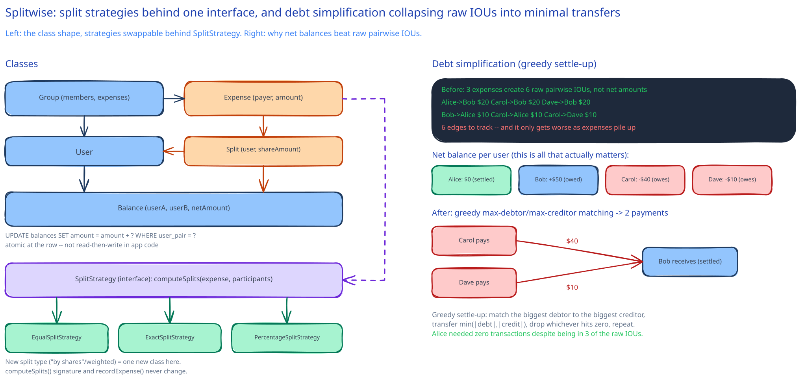

# LLD Worked Example: Splitwise (Expense Splitting)



Splitwise earns its spot as a classic LLD prompt for a reason most "CRUD with extra steps" prompts don't: recording an expense is the easy 20% of the problem. The other 80% — a pluggable split policy, and a debt-simplification algorithm that turns a pile of pairwise IOUs into the smallest possible set of payments — is where the interview actually happens. Get the entities right and the split types behind one interface, and the only genuinely hard part left is the graph problem hiding inside "who pays whom."

## The entities

- **`Group`** — owns the member list (`User`s) and every `Expense` recorded against it. The entry point for "add an expense," "show balances," "settle up."
- **`User`** — a person, usually a member of several groups at once. Balances aren't tracked per group, though — see `Balance` below.
- **`Expense`** — has a `payer` (`User`), a total `amount`, and a list of `Split`s produced by whichever `SplitStrategy` computed them.
- **`Split`** — one line item of "this `User` owes this `shareAmount`," belonging to one `Expense`. The sum of every `Split.shareAmount` on an `Expense` always equals `Expense.amount`.
- **`Balance`** (the ledger) — the net amount owed between one pair of users: `(userA, userB, netAmount)`, where a positive `netAmount` means `userA` owes `userB`. Every `Expense` and every settlement payment writes to this row, and it's the thing the concurrency race below is actually about.

## The decision that's Strategy, not a special case

Three split types cover the overwhelming majority of real usage: **equal** (divide the amount evenly across participants, with the odd cent from integer division routed to one arbitrary participant so the split still sums exactly to the total), **exact** (the payer specifies each participant's dollar amount directly, validated to sum to `Expense.amount`), and **percentage** (the payer specifies each participant's share as a percentage, validated to sum to 100). All three are just implementations of one `SplitStrategy` interface with one method, `computeSplits(expense, participants) -> List<Split>`. This is the exact shape [SOLID's Open/Closed section](solid-principles.md) and [the Strategy pattern](design-patterns-in-system-design/10-strategy.md) both describe: swapping the split policy shouldn't touch the code that records the expense. Adding a fourth kind — "by shares," e.g. splitting rent 2:1:1 by room size — is one new class implementing the same interface; `Group.recordExpense()` never changes.

Worth distinguishing from the debt-simplification algorithm two sections down: split-type really is a swappable policy — three valid, mutually interchangeable answers to "how do I divide this expense." Debt simplification isn't a policy choice in the same sense. There's one correct greedy algorithm for "minimum transactions to zero every balance," so it belongs directly in the class design (`Group`, or a dedicated `SettlementService`), not behind an interface with alternate implementations nobody would ever actually swap in.

## The concurrency race, and where it's actually enforced

Two group members can add expenses involving the same pair of users at the same time — or one member adds an expense while another records a settlement payment for that same pair — and both operations ultimately do the same thing to the same `Balance` row: read the current `netAmount`, compute a new one, write it back. That's a classic read-modify-write race. If both operations read `netAmount = 20`, one computes `20 + 15 = 35` (a new expense) and the other computes `20 - 20 = 0` (a settlement), whichever writes last wins and silently erases the other's update. The `Expense` and `Split` rows are still safely persisted either way — only the ledger itself ends up wrong, and nobody sees an error.

The fix is the same one this guide names for every shared counter: an increment expressed as a single atomic statement, not a read-then-write round trip in application code — `UPDATE balances SET amount = amount + ? WHERE user_pair = ?`. There's no gap between read and write for a concurrent update to land in, because there's no separate read: the database computes `amount + delta` and writes it in one step, for every writer, in whatever order they actually arrive. This is the same principle this guide's [Rate Limiter](lld-rate-limiter.md) page makes for a token count and its [Distributed Locks](../scalability-resilience/distributed-locks.md) page makes for any shared resource: the atomicity has to live where the shared state actually lives, not in a lock — or worse, nothing — wrapped around the caller's own read-modify-write.

## Pseudocode for recording an expense and settling up

```
Group.recordExpense(payer, amount, participants, splitStrategy):
    expense = Expense.create(payer, amount)
    expense.splits = splitStrategy.computeSplits(expense, participants)

    for split in expense.splits:
        if split.user == payer:
            continue                                          # payer doesn't owe themselves
        balanceRepository.applyDelta(split.user, payer, split.shareAmount)

    expenseRepository.save(expense)
    return expense

BalanceRepository.applyDelta(userA, userB, delta):
    # netAmount > 0 means userA owes userB -- one atomic statement, no read-modify-write
    UPDATE balances
    SET amount = amount + delta
    WHERE user_pair = pairKey(userA, userB)
```

```
Group.settleUp():
    balances = balanceRepository.netBalancesForGroup(this.id)     # {user -> netAmount}
    debtors = maxHeapOf(u for u in balances if u.netAmount < 0, key=abs(netAmount))
    creditors = maxHeapOf(u for u in balances if u.netAmount > 0, key=netAmount)
    payments = []

    while debtors and creditors:
        debtor, creditor = debtors.popMax(), creditors.popMax()
        amount = min(abs(debtor.netAmount), creditor.netAmount)
        payments.append(Payment(from=debtor.user, to=creditor.user, amount=amount))

        debtor.netAmount += amount
        creditor.netAmount -= amount
        if debtor.netAmount != 0:   debtors.push(debtor)         # partially settled, still owes
        if creditor.netAmount != 0: creditors.push(creditor)     # partially settled, still owed

    return payments   # minimum-size set of transfers that zeroes every balance
```

## Interviewer follow-ups

**Should `Balance` be scoped per group, or global per user pair?**
Real Splitwise does both: a `Balance` row per `(userA, userB, groupId)` for "what this specific group owes," plus a separate aggregate per `(userA, userB)` across every shared group for "what you owe this friend overall." `Group.settleUp()` above runs against whichever scope the feature needs — one group's balances, or the friend-level aggregate — the algorithm itself doesn't change, only which rows `netBalancesForGroup()` reads.

**Does simplifying debts change who owes what?**
No, and that's the property that makes it safe to run automatically. The greedy algorithm only changes the *number and direction* of transactions; it never invents or forgives debt, because it operates on the same net balances the un-simplified ledger already implies. The real reason Splitwise makes "simplify debts" a toggle rather than mandatory is UX, not correctness — some users want to see they specifically owe the friend who covered a particular expense, not a stranger a graph algorithm picked for them.

**What happens if a client retries the same "add expense" request — a flaky network call, a double-tap?**
Without protection, the retry runs `recordExpense()` twice, and the atomic balance update above happily applies the same delta twice — atomicity prevents the race, not the duplicate. The fix is the same one this guide's [Idempotency Keys](../scalability-resilience/idempotency-keys.md) page names for any retryable write: the client attaches an idempotency key to the request, and `recordExpense()` checks it before touching `Balance` at all, so a retried request returns the already-created `Expense` instead of creating a second one.
