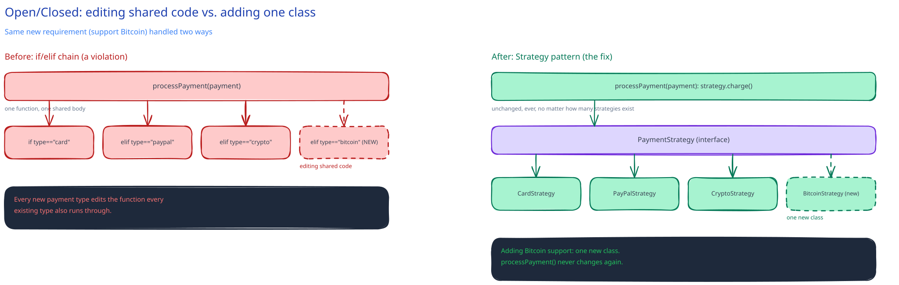

# SOLID Principles for System Design

[HLD is the floor plan, LLD is the wiring diagram](../../02-lld-fundamentals.md) — precise enough that two engineers implementing from it end up with compatible code. SOLID is what keeps that wiring changeable once real requirements start arriving: each letter names a concrete symptom you'll actually recognize in a codebase, not an abstract virtue.

## S — Single Responsibility

A class should have one reason to change. Violation, concretely: a `UserService` that also formats welcome emails and writes audit logs. A change to the email template's HTML now sits in the same diff, the same review, and the same blast radius as a change to password validation — two unrelated changes that happen to live in one class now risk breaking each other.

## O — Open/Closed

Open for extension, closed for modification. Violation, concretely: adding a new payment method means editing a growing `if/elif` chain inside `processPayment()`. Every new provider is a change to code every *existing* provider also runs through — one typo in the new branch can break checkout for a payment method that didn't change at all. The fix is the same [Strategy pattern](../../02-lld-fundamentals.md) this guide's `KeyGenerator` already uses: one interface, one class per payment provider, and `processPayment()` never grows again.

## L — Liskov Substitution

A subtype must be usable anywhere its supertype is expected, without surprising the caller. Violation, concretely: a `ReadOnlyUserRepository extends UserRepository` that throws on `save()`. Any code written against the `UserRepository` interface — which is the entire point of depending on an interface — now has a subtype that silently breaks that contract, and nothing in the type system catches it until it throws in production.

## I — Interface Segregation

Don't force a class to depend on methods it doesn't use. Violation, concretely: one `Worker` interface with `code()`, `test()`, and `deploy()`. A class that only ever tests still has to implement (or stub) `deploy()` it never calls — and a change to the deploy contract can now break a class that has nothing to do with deploying.

## D — Dependency Inversion

Depend on abstractions, not concrete implementations. This is exactly the principle behind this guide's own [`UrlRepository` interface](../../02-lld-fundamentals.md): the service depends on an interface, never directly on `SqlUrlRepository`, so a `DynamoDbUrlRepository` can be swapped in later and the service never changes.

## The honest caveat

Applying all five to everything up front is its own anti-pattern — an interface with exactly one implementation that will only ever have one implementation is needless indirection, not good design. This guide's [URL Shortener practice section](../case-studies/url-shortener/README.md) already asks exactly this question for custom aliases and expiration: notice where an interface boundary is *earning* its place versus where it's decoration.

## Interviewer follow-ups

**How would you refactor a class violating SRP without a big-bang rewrite?**
Extract one responsibility at a time behind a narrow interface, keep the original class delegating to it, and let callers migrate incrementally — the same interface-first move used everywhere else in this page, applied to an existing class instead of a new one.

**What's a real cost of over-applying Interface Segregation?**
Interface sprawl: five tiny interfaces for a class that only ever has one caller and one implementation adds indirection every reader has to trace through, for a flexibility the system will never use. The principle earns its cost when there are genuinely multiple callers with different needs, not by default.

**How does Dependency Inversion actually help with testing?**
A service that depends on a `UrlRepository` interface can be tested against an in-memory fake implementing that interface, with no database involved at all — a service depending directly on `SqlUrlRepository` can't be tested without one, because there's no seam to substitute anything at.

**Should you pick the pattern first, or the problem first?**
The problem, always — recognize "I have several interchangeable algorithms for the same job" and Strategy follows, rather than starting from "I should use Strategy somewhere." A pattern applied because it was recognized fits; a pattern applied because it was decided on in advance usually doesn't.
