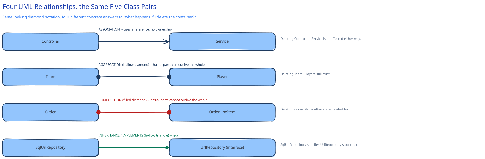

# UML & Class Diagram Basics

UML is a shared vocabulary, not a deliverable — the point of a class diagram in an interview is that you and the interviewer can both look at one box-and-line sketch and agree on what it means, without either of you re-explaining basic notation mid-conversation. This page covers only the notation this guide's own diagrams already lean on: enough to read and draw one, not the full UML specification.

## A class box, and what its three sections mean

A class box is split into name, attributes, and methods. In an LLD sketch, the attribute types and method signatures are usually left out or abbreviated — the box's job is to say what a class *owns* and *does*, not to compile.

## The relationships that actually matter, each with a concrete difference

- **Association** — one class uses another, with no ownership implied. A `Controller` that calls a `Service` is an association: the controller doesn't own the service's lifecycle, it just holds a reference to it.
- **Aggregation** (hollow diamond) — a "has-a" relationship where the parts can outlive the whole. A `Team` has `Player`s, but a player still exists if the team is deleted — the relationship is real, but not one of lifecycle ownership.
- **Composition** (filled diamond) — a stricter "has-a" where the parts *cannot* outlive the whole. An `Order` has `OrderLineItem`s, and deleting the order deletes its line items — they have no independent existence. This is the distinction worth being precise about: aggregation and composition look almost identical on a diagram (both "has-a," both drawn as a diamond) but answer a different concrete question — "if I delete the container, what happens to the contents?"
- **Inheritance** (hollow triangle, pointing at the parent) — an "is-a" relationship. This guide's [URL Shortener LLD](../../02-lld-fundamentals.md) draws this as `SqlUrlRepository` implementing the `UrlRepository` interface — in UML terms, a hollow-triangle arrow from the implementation to the interface it satisfies.

## Interfaces vs. abstract classes, briefly

An interface declares *what* a class can do with no implementation at all — this guide's `UrlRepository`, `CacheClient`, and `KeyGenerator` (cross-ref [`../../02-lld-fundamentals.md`](../../02-lld-fundamentals.md)) are all interfaces for exactly this reason: multiple unrelated implementations (SQL, DynamoDB, Redis) satisfy the same contract. An abstract class can hold shared implementation AND declare methods subclasses must still fill in — reach for it when several subclasses genuinely share behavior, not just a shape.

## Sequence diagrams, briefly — the other half of LLD

A class diagram shows *structure* (what exists); a sequence diagram shows *behavior* (what happens, and in what order, for one specific request). This guide's own [URL Shortener LLD](../../02-lld-fundamentals.md) uses exactly this pair — a class diagram for the five classes, a sequence diagram for what actually happens on `GET /{code}` — because neither one alone answers both "what are the pieces" and "what order do they get called in."

## Interviewer follow-ups

**How much UML detail is expected in a live interview?**
Boxes, names, and the relationship lines that matter (mainly inheritance/implements and composition vs. aggregation when the distinction is actually load-bearing) — full attribute types and visibility modifiers (`+`/`-`/`#`) are almost never worth the time they cost to draw on a whiteboard.

**When would you draw composition instead of just aggregation, and does it actually change the design?**
When the child object's lifecycle genuinely has no meaning outside the parent — if you'd ever need to query "all `OrderLineItem`s independent of any order," it's not composition. Getting this right affects real decisions like cascade-delete behavior in a database schema, not just diagram notation.

**Why prefer an interface over an abstract class when you're not sure yet?**
An interface costs nothing to add later and imposes no shared implementation you might not want; an abstract class is a stronger commitment (single inheritance in most languages means a class can extend at most one). Defaulting to interfaces and only promoting to an abstract class once you've confirmed real shared implementation avoids painting yourself into that corner.
