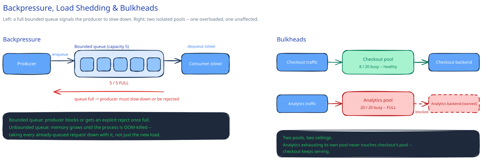

# Backpressure, Load Shedding & Bulkheads

## A different problem from a circuit breaker

[Circuit breakers](circuit-breakers-retries.md) exist because a *downstream* dependency is failing or slow — every dependency here can be perfectly healthy, and this page still applies, because the problem is that **your own service** is receiving more load than it can handle. A circuit breaker protects you from a bad dependency; backpressure and load shedding protect you — and your callers — from yourself being the overloaded one.

## Backpressure: a signal that travels backward

When a downstream stage (a queue consumer, a worker pool) can't keep up with its producer, it needs a way to say "slow down" rather than let work pile up unboundedly in memory until the process is OOM-killed. The concrete mechanism is a **bounded** queue — not unbounded — whose producer either blocks or gets an explicit "not ready" signal once the queue is full (the same queue-depth-as-signal idea this guide's [message queues](../hld-building-blocks/message-queues-pubsub.md) page touches on).

An unbounded queue isn't a design nicety away from being safe — it's a bug waiting to happen. Memory grows without limit until the process is killed, and that kill takes down every request already safely queued along with whatever new load arrived. Bounding the queue turns an eventual crash into an immediate, visible backpressure signal, which is strictly easier to handle.

## Load shedding: rejecting work on purpose

Once queue depth (or a similar signal) crosses a threshold, the deliberate move is to reject **new** incoming requests — usually with a fast, cheap-to-produce error like `503` — rather than accept them and let everything, including requests already in flight, degrade to unusably slow together.

**Priority shedding** goes further: shed the *least* important requests first, if you can classify them — drop a "recommendations" call before a "checkout" call. This only works if request priority is already labeled somewhere upstream; it's a real design decision, not something a load shedder can infer on its own.

## Bulkheads: isolation by partitioning resources

Named for ship compartments that keep one hull breach from sinking the whole ship. Give each type of work its **own** resource pool — a thread pool, a connection pool to one specific downstream — instead of sharing one pool across everything. Without this, one overloaded or misbehaving caller can exhaust a *shared* pool and starve every other kind of work that happens to use it: a slow analytics query flooding a shared thread pool can starve the threads checkout requests need, taking down revenue-critical traffic because of a non-critical feature. A bulkhead means that failure can only ever exhaust its own compartment.

## Not the same axis as rate limiting

[Rate limiting](../hld-building-blocks/rate-limiting.md) protects against one client exceeding *its own* quota. Load shedding protects the whole service once **aggregate** load — from every client combined, each individually within quota — exceeds what the service can actually handle. A client can be perfectly within its rate limit and still be the request that gets shed, because the problem load shedding answers isn't "is this caller misbehaving," it's "can we handle everyone right now."

## Interviewer follow-ups

**How would you decide the queue-depth threshold that triggers shedding, and what happens if you get it wrong in either direction?**
Set it from measured queue-drain rate under load, not a guess — too low and you shed traffic you could have handled, wasting capacity; too high and the queue's already deep enough that even accepted requests wait long enough to breach their own SLA before they're ever served.

**Would you shed load at the load balancer, the gateway, or inside each service instance — why might the answer be "all three"?**
Each catches a different scale of overload: the [load balancer](../hld-building-blocks/load-balancing.md) sheds before a struggling backend instance is chosen at all, the [gateway](../hld-building-blocks/api-gateway.md) sheds before internal services see the request, and per-instance shedding catches load that's evenly spread across healthy-looking instances but still exceeds each one's real capacity. Any single layer alone misses whichever failure mode lives at the other layers.

**How do bulkheads interact with autoscaling — does giving a pool more resources solve the isolation problem, or just delay it?**
Delay it. Autoscaling adds capacity to a pool, but if that pool is still shared across workload types, a large enough spike in the noisy one still exhausts it — just at a higher ceiling. Bulkheads solve isolation; autoscaling solves capacity. You generally need both, not one instead of the other.

**Is a bulkhead's fixed pool size itself a limit on legitimate work, even when the system overall has spare capacity?**
Yes, deliberately — that's the trade being made. A workload capped at its own pool can't use idle capacity sitting in another workload's pool, which wastes some resources in exchange for guaranteeing that workload's failure stays contained. Sizing each pool close to its workload's real peak, rather than padding heavily, keeps that waste small.
