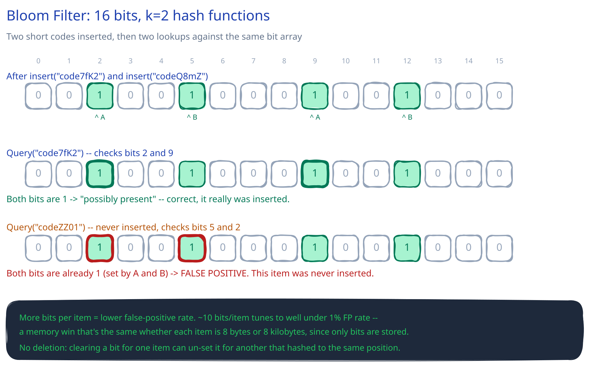

# Bloom Filters

## What problem it solves

A bloom filter answers "have I possibly seen this before?" for a huge set, using far less memory than storing the set itself — at the cost of allowing **false positives** (it can wrongly say "yes, probably" for something never inserted) but **never false negatives** (if it says "no," the item is definitely not in the set). That asymmetry is exactly what makes it useful as a cheap first check in front of something expensive: this guide's [URL Shortener](../../02-lld-fundamentals.md) can check "does this short code already exist" against a bloom filter before ever touching the database — a "no" ends the check for free, and a "yes" just means "go check the database to be sure."

## How it actually works

A bit array of size *m* (all zeros initially) and *k* independent hash functions.

- **Insert**: hash the item *k* ways, set those *k* bit positions to 1.
- **Query**: hash the item the same *k* ways. If *any* of those bits is 0, the item was **definitely never inserted** — one zero is proof of absence. If *all k* bits are 1, the item was **probably inserted** — but those bits could have been set by *other* insertions that happened to land on the same positions, which is exactly what a false positive is.

The diagram above works a concrete case: *m*=16 bits, *k*=2. Inserting `"code7fK2"` sets bits 2 and 9; inserting `"codeQ8mZ"` sets bits 5 and 12. Querying `"code7fK2"` again checks bits 2 and 9 — both are 1, correctly reported as present. Querying `"codeZZ01"`, which was never inserted, happens to hash to bits 5 and 2 — both already 1 from the *other* two inserts — so the filter reports it as present anyway. That's the false positive, and it's not a bug: it's the trade-off the whole structure is built on.

## The size/accuracy trade-off

The false-positive rate depends on *m* (bits), *n* (items inserted), and *k* (hash functions). More bits per item pushes the rate down; too few hash functions and the filter can't discriminate between items, too many and it saturates with 1s faster than it needs to. A well-tuned filter hits well under a 1% false-positive rate at roughly **10 bits per item** — and that number doesn't change whether each item is an 8-byte short code or an 8-kilobyte URL, because the filter never stores the item, only which bits its hashes touched. That size-independence is the actual memory win over keeping the real set around.

## What it can't do

- **No deletion.** Clearing a bit to "remove" an item can un-set it for a *different* item that happens to hash to the same position — there's no way to tell, from a single bit, which items contributed to it being 1. The fix, when deletion is a real requirement, is a **counting bloom filter**: small counters instead of single bits, so a delete only decrements a counter rather than blindly zeroing a bit — at higher memory cost than the plain version.
- **No membership listing.** It can only answer "might this specific item be in the set," never "what's in the set" — there's nothing to enumerate.

## Interviewer follow-ups

**Why is a false negative fundamentally impossible but a false positive isn't?**
A bit only ever gets set to 1 by an actual insert, never cleared (in the standard, non-counting version). If an item was truly inserted, all *k* of its bits are guaranteed to be 1 forever — a query for it can never see a 0 among its bits. A false positive is the mirror case: bits being 1 for the *wrong* reason, because unrelated inserts happened to touch the same positions.

**How would you use a bloom filter to avoid unnecessary database lookups for keys that definitely don't exist?**
Keep a filter of every key that exists (e.g. every short code ever issued), sized for the expected total count. Before a lookup, check the filter first: a "no" skips the database entirely; a "yes" proceeds to the real lookup as normal. The database remains the source of truth — the filter only ever saves work, it never replaces the check.

**What happens to the false-positive rate as you keep inserting more items than the filter was sized for?**
It climbs, smoothly and predictably — more inserts means more bits set to 1, so more coincidental overlaps on any given query. Sized for *n* items, a filter holding 2x or 3x *n* items will false-positive far more often than its nominal rate; this is a capacity-planning number, not a fixed property of the structure, so it has to be sized for the set's expected *eventual* size, not its size on day one.

**Would you use a bloom filter for a set where an occasional wrong "yes" is actually costly, e.g. authorizing a payment?**
No — a false positive there means treating something as valid when it isn't, which is exactly the class of mistake a payment path can't absorb. A bloom filter belongs in front of an expensive-but-authoritative check (skip the DB lookup on a confident "no"), never as the authoritative check itself.
