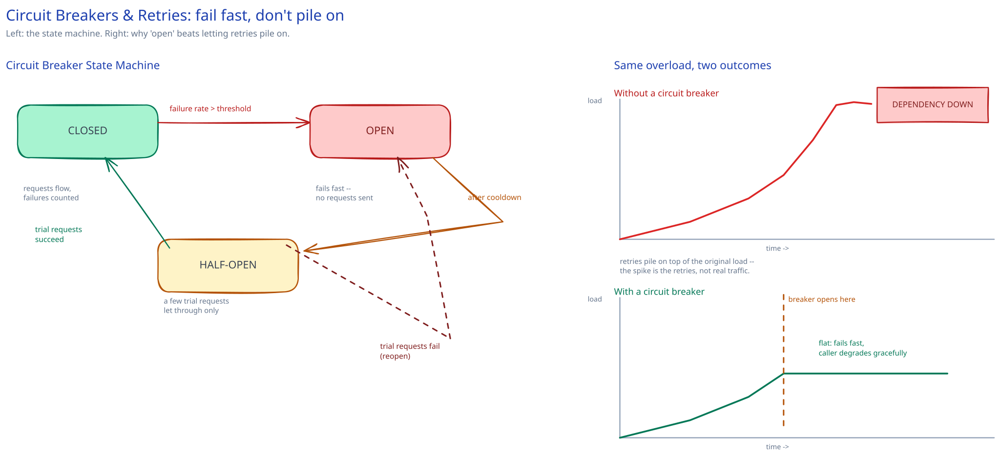

# Circuit Breakers & Retries

## Why naive retries make things worse

Service A calls a struggling service B. B isn't down — just slow, overloaded, running near its ceiling. A's naive fix, "retry on timeout," is exactly the wrong move: every one of A's callers now sends the *original* request plus at least one retry, multiplying the load hitting the dependency that's already drowning. This is a real, well-documented failure pattern (a "retry storm") that turns a slow dependency into a fully-down one, and it's usually the retries — not the original incident — that tip it over.

Two ingredients fix the retry itself, though not the underlying problem (that's what the circuit breaker below is for):

- **Exponential backoff** — each retry waits longer than the last (100ms, 200ms, 400ms, ...) instead of hammering immediately.
- **Jitter** — randomize the exact wait so thousands of callers who all failed at the same instant don't retry in lockstep. Backoff without jitter still produces synchronized spikes — just delayed and less frequent ones, not smoothed ones.

## The circuit breaker: three states

- **Closed** — normal operation. Requests flow through to the dependency; failures are counted.
- **Open** — the failure rate crossed a threshold. The breaker stops sending requests to the dependency *immediately* and fails fast instead, giving the dependency room to recover instead of staying buried under continued load.
- **Half-open** — after a cooldown, let a small number of trial requests through. If they succeed, close the breaker. If they fail, reopen it and wait again.

"Fail fast" is the entire point, and it protects the caller as much as the callee: a request that gets an instant error can degrade gracefully — serve a cached/stale value, render a partial page without the broken widget. A request that instead waits out the *full* timeout on every call just piles up threads/connections waiting on a dependency that was never going to answer in time, which can take **A** down too, not just B. An open breaker isn't giving up on the request; it's refusing to pay a cost it already knows won't be worth it.

## What actually deserves a retry

Only failures that are both **transient** and **safe to repeat**:

- A network blip on a `GET` — safe, nothing changes by asking twice.
- A write made safe by an [idempotency key](idempotency-keys.md) — safe, the server can recognize and discard the duplicate.
- A plain write with no idempotency key and no other safeguard — **not safe**. If the first attempt actually succeeded server-side and only the *response* was lost, blindly retrying can charge a card twice, double-book a seat, or double-send a notification. This is the single most common retry bug in real systems: the failure that gets handled is "did I get a response," when the question that matters is "did the effect happen."

## Timeouts make any of this possible

Without a deliberately short timeout, a caller can't distinguish "slow" from "hung," and neither retries nor a circuit breaker ever get a chance to trigger — they're both downstream of "the call failed," and a call that's still pending hasn't failed yet. A timeout should be set well below the caller's *own* SLA budget, not picked as a round number (a caller with a 500ms budget calling a dependency with a 10s timeout has already lost by the time it discovers a problem).

## Interviewer follow-ups

**Should a circuit breaker be per-downstream-service or global to a caller?**
Per-dependency. A shared/global breaker means one struggling dependency trips the breaker for every *other* dependency too, which stops a caller from reaching services that are perfectly healthy — the failure isolation the pattern exists for is lost if the breaker doesn't isolate by dependency.

**What's the risk of retrying a request that actually succeeded on the server, but the response was lost in transit?**
Exactly the non-idempotent-write problem above: the caller sees a timeout and can't tell success from failure, so a naive retry re-executes an action that already happened. The fix lives on the server side (idempotency keys, so a duplicate is recognized and safely ignored), not on the retry logic — the caller genuinely cannot know the difference from where it's standing.

**How would you decide the failure-rate threshold that trips a breaker open?**
Start from the dependency's own acceptable-error baseline (if it normally runs at 1-2% errors, don't trip at 3%) and the caller's tolerance for false trips (tripping too eagerly fails fast on transient blips that would've recovered on their own). Most real implementations also require a minimum request volume before evaluating the rate at all, so 2 failures out of 3 requests during a quiet period doesn't trip a breaker that hasn't seen enough traffic to mean anything.

**Does a circuit breaker replace [rate limiting](../hld-building-blocks/rate-limiting.md)?**
No — they answer different questions. Rate limiting caps how much traffic a caller is *allowed* to send, regardless of whether the dependency is healthy. A circuit breaker reacts to whether the dependency actually *is* healthy, independent of how much traffic was permitted in the first place. A well-protected call path usually has both.
