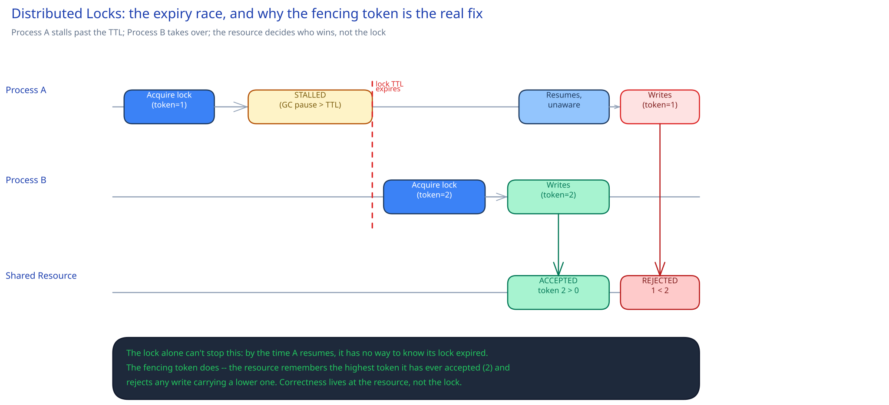

# Distributed Locks

## What problem it solves

An in-process mutex protects a resource from two threads in the *same* process. It's useless the moment the competing callers are two different machines — which is the normal case in any horizontally-scaled system. Take two instances of a scheduled job service, both waking up at midnight to run "send the daily report": with no coordination, both instances see the same clock, both decide it's their turn, and both run it — the report goes out twice, or a batch charge gets applied twice. A distributed lock is how one instance says "I've got this" in a way every *other* instance, on every other machine, can actually see and respect.

## The basic mechanism

A distributed lock needs a store every candidate can reach: Redis, Zookeeper, or even a single database row. The pattern is "acquire if nobody else holds it, with an expiry": in Redis terms, `SET lock:daily-report holder-id NX EX 30` — `NX` means "only set this if the key doesn't already exist," so exactly one caller's `SET` succeeds; everyone else's fails and they back off or wait. The `EX 30` (a 30-second TTL) matters for a reason that has nothing to do with contention: without it, a lock-holder that crashes mid-job leaves the lock held forever, and nobody else can *ever* acquire it again. A lock with no expiry turns one crash into a permanent outage.

## The dangerous race a naive TTL-based lock has

Giving the lock a TTL fixes the "held forever" problem and opens a subtler one. Walk through it:

1. Process A acquires the lock (`token = 1`) and starts work.
2. A stalls — a GC pause, a slow disk, a scheduler hiccup — for *longer* than the 30-second TTL. This isn't exotic; it's the normal failure mode TTLs exist to survive.
3. The lock expires while A is still stalled. Process B acquires it (`token = 2`) and starts the same job.
4. A resumes. It never crashed and never checked back in — as far as A's own execution is concerned, it still holds the lock it acquired in step 1. A finishes its work and writes to the shared resource.

Now A and B have both run the job, believing the whole time that only one of them held the lock — because for a window, that was even true. The lock itself can't prevent this: by the time A resumes, the lock object has no way to tell A "you're stale."

The real fix lives one layer down, at the resource being protected, not at the lock: a **fencing token** — a number that increases by one every time the lock is acquired, handed to whoever acquires it, and passed along with every write to the protected resource. The resource remembers the highest token it has ever accepted and rejects any write carrying a lower one. In the trace above, B's token (2) is accepted and becomes the new high-water mark; when stale A finally writes with its old token (1), the resource sees `1 < 2` and rejects it — not because the lock caught the race, but because the resource itself refused a write it could prove was late.

## When a "simple enough" lock is fine, and when it isn't

A single-Redis-instance lock is a reasonable, cheap choice when the cost of a rare double-execution is low — an idempotent job that just wastes a little redundant compute if it runs twice is not worth building real consensus for. Redlock-style multi-node locking, or leaning on a genuine consensus system ([replication & consensus](../hld-building-blocks/replication-consensus.md)), is what you reach for when two simultaneous holders is a correctness violation, not an inefficiency — a financial ledger update, a physical resource that can't be double-booked. Even then, the fencing token at the resource is still the actual safety net; a fancier lock reduces how *often* two holders overlap, but only the resource enforcing tokens makes it *impossible* for a stale holder's write to land.

## Interviewer follow-ups

**How would you choose a TTL for a lock protecting a job that normally takes 10 seconds but occasionally takes 40?**
Above the worst realistic case, not the typical one — a TTL of 30 seconds would expire mid-job on every slow run and trigger exactly the dangerous race this page describes. Size it to the P99+ runtime with margin, and treat frequent near-misses as a signal the job itself needs a heartbeat/lease-renewal mechanism rather than a longer flat TTL.

**What's the difference between a lock and a lease?**
A lease is a lock with a built-in, mandatory expiry and (usually) a renewal mechanism, framed explicitly as "I hold this *until* time T unless I renew" rather than "I hold this until I release it." The terminology shift matters because it puts the expiry into the holder's mental model up front, instead of treating a TTL as an implementation detail bolted onto a lock that conceptually never expires.

**Why not just make the TTL very long, to avoid the expiry race entirely?**
Because the TTL is also what recovers from a crashed holder — a long TTL means a crash (not just a stall) leaves the resource unavailable for that entire window with nobody able to take over. The expiry race and the crash-recovery time are the same knob pulling in opposite directions; you can't fix one by pushing the TTL further without making the other worse. That tension is exactly why the fencing token exists — it lets you keep the TTL short (fast recovery) without the expiry race being unsafe.
