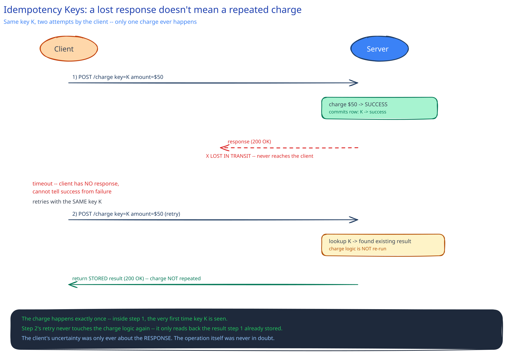

# Idempotency Keys

## The concrete bug this prevents

A client calls "charge $50." The server receives it, charges the card, and sends back a success response — but the response is lost in transit (a dropped connection, a proxy timeout, doesn't matter which). The client only knows it didn't get an answer; it has no way to tell "the charge failed" apart from "the charge succeeded and the response died." A naive retry — exactly the behavior [circuit breakers & retries](circuit-breakers-retries.md) says is safe for transient failures — resends the same charge and now the card is billed twice. The failure the client can observe ("did I get a response") is not the question that matters ("did the effect happen"). Idempotency keys are the mechanism that closes that gap.

## How it works, precisely

The client generates one unique idempotency key — usually a UUID — per *logical* operation, and sends that same key on every attempt of that operation, retries included. The server keeps a record of `idempotency key -> result` for some retention window:

- First time the server sees a key: process the request normally, then store the result keyed by it.
- Any later request with the *same* key: skip processing entirely and return the stored result.

Trace the actual failure from above with this in place: request 1 arrives with key `K`, the server charges $50 and commits a row `(K -> {status: succeeded, charge_id: ...})`, then the response is lost before the client sees it. The client times out and retries with the *same* key `K`. The server looks up `K`, finds it already has a stored result, and returns that result directly — no second charge happens. The charge itself only ever happens once; only the client's *certainty* about it was ever in question.

## Where the record has to live, and the race it has to survive

The "have I seen this key" check and the actual operation can't be two separate steps — if the server checks for `K`, doesn't find it, and only *then* performs the charge and records `K` afterward, two concurrent requests carrying the same key can both pass the check before either one finishes recording it. That's a plain check-then-act race (a TOCTOU bug), and it double-processes the operation despite the idempotency key being present and correct.

The fix is to make "recognize the key" and "commit the operation" the same atomic step: a **unique constraint on the idempotency key column**, written in the same transaction as the operation's own state change. Two concurrent requests with key `K` both attempt to insert a row for `K`; the database's unique index lets exactly one of those inserts win, and the loser's request handler sees a constraint violation, which it interprets as "someone else already has this — go read their result," not as an error to surface to the client.

## What it doesn't solve

An idempotency key protects against **duplicate submission** of one operation — it doesn't make the operation's own side effects safe by itself. If the handler behind it does a raw `balance = balance - 50` instead of a versioned or conditional update, a completely separate bug (a race unrelated to retries) can still double-apply that decrement outside the idempotency-key path entirely; the key guards re-*submission*, not every possible concurrency bug in the handler it wraps. And it's scoped to one logical operation — two genuinely separate purchases each need their own key; reusing one key across different intents just makes the second one silently return the first one's result.

## Interviewer follow-ups

**How long should the server retain idempotency records, and what happens when a retry arrives after that window expires?**
Long enough to outlast any realistic client retry window — minutes to at most a day or two for most APIs, not indefinitely (the record table would grow forever otherwise). A retry that arrives after expiry is indistinguishable from a brand-new request with a coincidentally-reused key, so it gets processed again — which is why the expiry window should comfortably exceed how long a reasonable client-side retry loop would actually keep trying.

**Should the idempotency key be client-generated or server-generated, and why does that answer matter?**
Client-generated. The whole point is that the *same* key has to be attached to every attempt of one logical operation, including the retry that happens after the client never received a response — the client is the only party present for all of those attempts. A server-generated key would be handed back in the (possibly lost) first response, which defeats the purpose.

**What should the server return for a duplicate key whose first attempt is still in flight, not finished yet?**
Not the final result (it doesn't exist yet) and not a silent re-process — typically a `409 Conflict` (or a `202`-style "still processing") telling the caller a request with this key is already in progress, rather than either blocking the second request indefinitely or racing it against the first.
