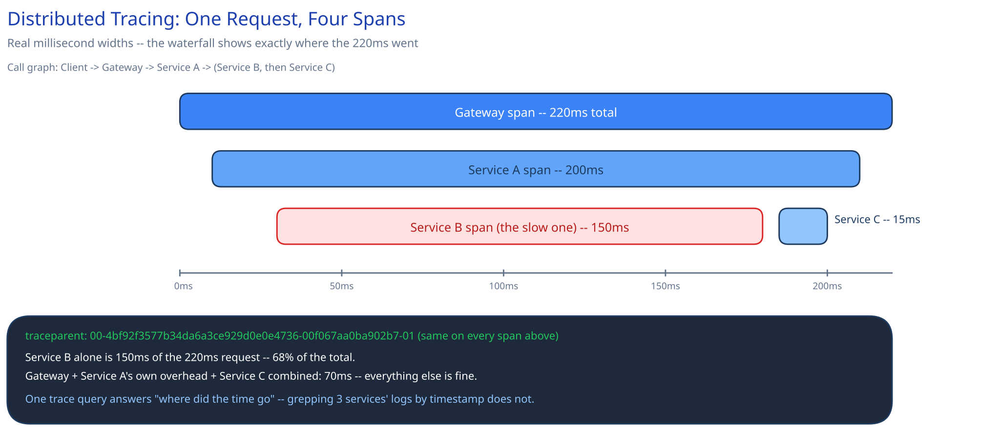

# Logs, Metrics & Distributed Tracing

## Three signals, three different questions

These aren't three ways to do the same thing — each answers a question the other two can't:

- **Logs** answer "what exactly happened, for this one event." High cardinality (every field, every value, every request), full context, but expensive to store and query at volume — you wouldn't log every field of every request forever.
- **Metrics** answer "how is the system doing, in aggregate, over time." A counter, gauge, or histogram, pre-aggregated so it's cheap to store — but that aggregation is also the cost: you know your p99 latency spiked at 14:03, not *which* request caused it.
- **Traces** answer "as this one request moved through N services, where did the time actually go." A request into a system built around an [API gateway](../hld-building-blocks/api-gateway.md) can touch 10+ backend services — without tracing, that's 10 separate services' logs with no way to connect them back into one story.

None of the three substitutes for the others. A metric tells you *that* something is wrong; a trace tells you *where*; a log tells you *exactly what* happened at that point.

## Why a trace needs one ID that survives every hop

A request that fans out across several services produces one log line per service, each with its own timestamp, none of them naturally linked. Without a shared identifier, "was this slow in the gateway, in service A, or waiting on service A's call to service B?" has no answer short of manually correlating timestamps across three separate log streams — and that falls apart the moment two requests overlap in time.

The fix: a **trace ID** generated once, at the edge (the gateway), and propagated on every downstream call — typically in a header (`traceparent` is the common one). Every service that touches the request tags its own log lines and spans with that same ID. Now "where did the time go" is one query — pull every span sharing that trace ID — instead of three separate greps hoping the timestamps line up.

## What a span actually is

A span is one timed unit of work inside a trace: "the gateway's handling of this request" is a span; its call into service A is a *child* span; service A's call into service B is a child of that. Spans nest, so a trace is a tree, and a trace *visualization* is literally a waterfall of those nested spans stacked by start time and width — which is exactly what makes "where did the time go" visible at a glance instead of requiring you to read timestamps and do subtraction.

## The cost, and why you sample instead of capturing everything

Full-detail logging and 100%-sampled tracing on every request both cost real money and real overhead — storage for the data, and CPU/network for emitting it on every single request, at every layer. Nobody runs this at 100% forever.

The practical answer is **sampling**: trace a small fraction of normal traffic (1% is a common starting point) for a baseline picture of typical behavior, but **always** trace anything that errored or blew past a latency threshold — the expensive detail exists exactly where you'll actually need it, not spread thin across millions of requests that were all fine.

## Interviewer follow-ups

**How would you correlate a spike in your error-rate metric with the specific requests causing it?**
The metric tells you *when* (the timestamp of the spike) and *which service*; from there you query traces filtered to that service and time window with an error status, which surfaces the actual failing requests — and each of those traces' logs gives you the full detail of what went wrong.

**What's the risk of logging a request's full payload for debugging?**
Payloads routinely contain PII or secrets (passwords, tokens, card numbers) that now sit in a log store with different (usually weaker) access controls and retention rules than the primary datastore — redact or exclude sensitive fields at the point of logging, not as an afterthought.

**How would you decide what to sample at 100% vs. 1%?**
Anything that already signals a problem — errors, timeouts, latency past your SLA — gets traced at 100%, because you can't retroactively trace a request you decided not to capture. Routine, healthy traffic gets sampled low, since its aggregate shape is already visible in metrics and any one such trace looks like all the others.
