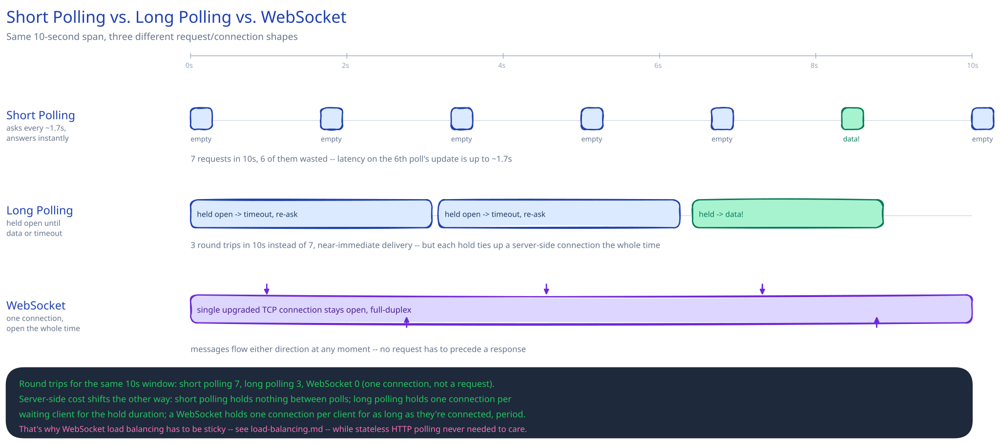

# Long Polling, WebSockets & SSE

## The problem

Plain HTTP is client-initiated: the server can only ever *reply* to a request, never originate one. That's fine when the client is the one with new information, but a lot of real events start on the server — a chat message from another user, a live score update, a notification — and the client has no way to find out except asking. Asking once won't do; the client would have to ask forever, and most of those asks will come back empty. This guide's [Read Receipts & "Online Now" at Scale](../../read-receipts-presence/README.md) deep dive is exactly this problem: presence and read state change on someone else's action, and every connected client needs to hear about it without hammering the server every second on the chance something moved.

## Short polling vs. long polling, concretely

**Short polling**: the client asks every N seconds; the server answers immediately, empty-handed or not. Simple to build, but it wastes a full request/response on the common case (nothing changed), and freshness is capped at N seconds no matter how small you make N — shrink N to fix latency and you just multiply the wasted-request problem.

**Long polling**: the client asks once; the server *holds the request open*, replying only when new data actually shows up or a timeout elapses — then the client immediately re-asks. This collapses most of the wasted round trips (a reply only goes out when there's something to say) and pushes latency close to real time. It's still bounded by HTTP's request/response shape, though: every update still costs a full round trip, and the server has to keep a connection (and usually a thread or an event-loop slot) reserved for the entire hold duration, for every client waiting — that's a real resource cost that scales with concurrently-waiting clients, not with how chatty they actually are.

## WebSockets, precisely

A WebSocket starts as an HTTP request but immediately upgrades (`Upgrade: websocket`) into a single, long-lived TCP connection that's full-duplex — either side can push a message at any moment, with no request needing to precede a response. That's the right shape for something genuinely bidirectional and frequent: a multiplayer game's position updates, a live chat's both-directions message flow.

The cost is structural, not incidental: every open WebSocket now holds real server-side state — a connection, a buffer, usually a dedicated thread or coroutine — for as long as the client stays connected, whether or not anything is being sent. That's the opposite scaling shape from the stateless request handling the rest of this guide assumes (see [the client-server model](../foundations/client-server-model.md)) — a stateless server can answer any client's next request; a WebSocket server has to be *that specific client's* server for the life of the connection. It changes how you [load-balance](../hld-building-blocks/load-balancing.md) too: routing has to be sticky, sending a client back to the exact instance holding its socket, not any healthy instance — and two clients connected to two different instances need some backplane between those instances to reach each other at all.

## SSE, and when it's actually the better choice

Server-Sent Events is a single long-lived connection like a WebSocket, but one-directional (server to client only) and built on plain HTTP — no upgrade handshake, so it passes through more proxies and corporate firewalls without special-casing, and the browser's `EventSource` API reconnects automatically on a drop, for free. If the only thing you need is the server pushing updates outward — a live notification feed, a live score, this guide's read-receipt/presence updates — SSE gets you that with less machinery than a WebSocket for an identical result. Reach for a WebSocket specifically when the client also needs to push back over the *same* channel at the same frequency; don't reach for it just because "real-time" is in the requirements.

## Interviewer follow-ups

**How would you scale a WebSocket-based chat service across many server instances so any two connected users can message each other regardless of which server they're on?**
Sticky-route each client to the instance holding its socket, then give the instances themselves a shared backplane — a pub/sub layer (see [message queues & pub/sub](message-queues-pubsub.md)) that every instance subscribes to, so a message for a user connected to instance B gets published once and instance B's local socket delivers it, no matter which instance received the send.

**What happens to open WebSocket connections during a rolling deploy?**
Every connection to a terminated instance drops — there's no graceful "finish this request first" the way stateless HTTP handling gets, because the connection *is* the ongoing unit of work. A real deploy needs the client to detect the drop and reconnect (ideally to a different instance) and the server side to drain connections onto surviving instances rather than killing all of them at once.

**Why might a corporate network block WebSockets when regular HTTPS traffic works fine?**
Some proxies and firewalls only understand request/response HTTP and don't know what to do with a long-lived upgraded connection sitting idle for minutes — a few actively terminate anything that looks like it's not a normal HTTP exchange. SSE's plain-HTTP shape is one reason it survives these environments more often than a WebSocket does.
