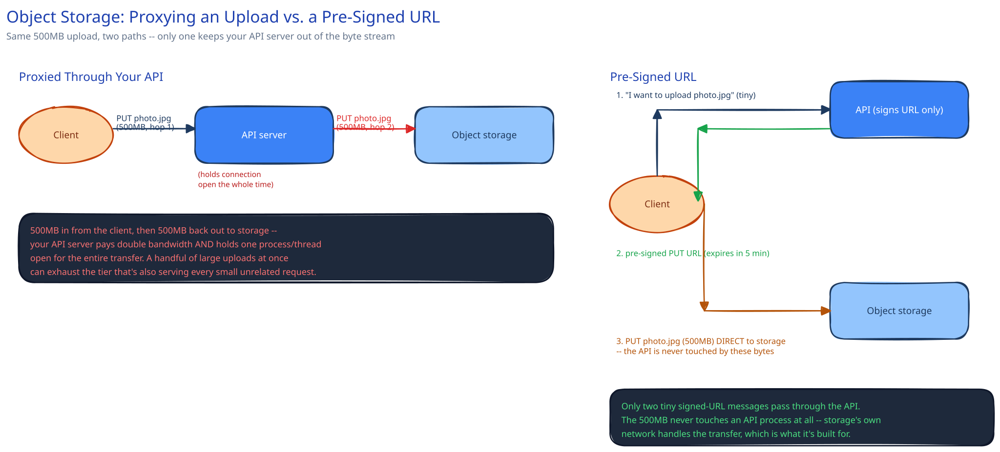

# Object / Blob Storage & Large Uploads

## Why large binaries don't belong in your primary database

A relational or document database is built for small structured records — indexed, joinable, transactional. Storing a 2GB video or even a 5MB image as a BLOB column bloats every backup, blows past sane row-size limits, and forces every replica to copy bytes that are never queried or joined against anything. Object storage (S3-style: a flat key → blob namespace, no folders, no transactions, no joins) is built for exactly this instead: the database stores a small pointer — a key or a URL — and the actual bytes live somewhere designed to hold them cheaply at scale. This guide's [Ephemeral Stories](../../README.md) deep dive is a concrete example of this split in practice: the media lives in object storage behind a CDN, and the database only ever holds a reference to it.

## The naive upload path, and why it doesn't scale

The obvious design — client uploads to your API, your API forwards the bytes to object storage — pays for the file's bandwidth *twice* (client → you, then you → storage) and ties up one of your API server's processes or threads for the *entire* transfer. A handful of concurrent large uploads can exhaust the same tier that's also trying to serve every small, unrelated request, because your API server is sitting in the middle of a data path it never needed to be part of.

## Pre-signed URLs: let the client upload directly

The fix removes your API from the byte stream entirely. The client asks your API for permission to upload — a cheap, fast call that touches no file data — and your API responds with a time-limited, cryptographically-signed URL scoped to one exact object key. The client then uploads *directly* to object storage using that URL; your API server never sees a single byte of the file.

Traced end to end:

1. Client → API: *"I want to upload `photo.jpg`"* (a tiny metadata request).
2. API → client: a pre-signed `PUT` URL, scoped to that exact key, expiring in ~5 minutes.
3. Client → object storage: the actual `PUT photo.jpg` (500MB), direct — the API is never touched by these bytes.

Only the two tiny signed-URL messages pass through your API. The transfer itself runs over storage's own network, which is what it's built to absorb.

## Multipart upload for large files

Above roughly 100MB, a file gets split into independently-uploaded parts — potentially in parallel, and each part individually retryable if it fails. This matters concretely: without multipart, a single 5GB upload that dies at 95% means starting over from zero; with it, only the one failed part needs to be resent.

## Interviewer follow-ups

**How would your API know an upload actually completed, if the client never calls back to confirm?**
Two options, often combined: the client explicitly notifies the API once the direct `PUT` succeeds, or the API subscribes to a storage-level event notification (most object stores can fire one on object creation) so completion isn't solely dependent on a possibly-flaky client callback.

**What stops a pre-signed URL from being abused if a client shares it?**
The short expiry window and the fact that it's scoped to one exact key and one exact operation (e.g. `PUT`, not arbitrary access) — anyone with the URL can complete that one upload before it expires, but not read/write anything else, and the window is designed to close before casual sharing matters.

**Would you serve downloads through your API server too, or also use pre-signed URLs / a CDN for that direction?**
The same logic applies in reverse: proxy-through-API for downloads pays the same double-bandwidth, held-connection cost. Pre-signed download URLs (or, for anything public and cacheable, a [CDN](../hld-building-blocks/cdn.md) in front of storage) keep the API out of that path exactly the same way.
