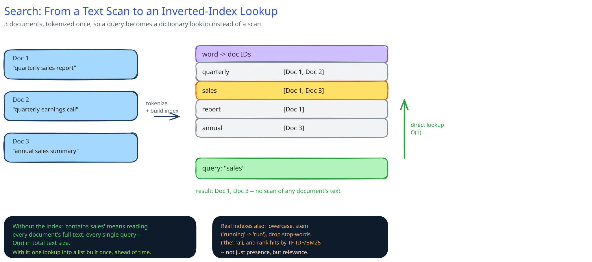

# Search & Inverted Indexes

## Why a normal DB index doesn't do this

A B-tree index ([Database Indexing](../database-design/database-indexing.md)) speeds up "find rows where `column = X`" or a range scan on that column — it's built for values you can compare and order. "Find every document that contains the word 'quarterly' anywhere in its text" isn't that kind of query: the word could be anywhere in a large text blob, in any order, alongside any other words. Answering it without a purpose-built structure means reading every row's full text, every time — an O(n) scan over your entire text corpus, per query.

## The inverted index, precisely

The data you naturally have is document -> words (a *forward* index: "Doc 1 contains these words"). Flip it: build word -> [documents containing it] instead. That flip is the entire trick.

Take three tiny documents:

- Doc 1: "quarterly sales report"
- Doc 2: "quarterly earnings call"
- Doc 3: "annual sales summary"

Tokenize each and invert the mapping:

| word | doc IDs |
|---|---|
| quarterly | [Doc 1, Doc 2] |
| sales | [Doc 1, Doc 3] |
| report | [Doc 1] |
| annual | [Doc 3] |

A query for `"sales"` is now a single dictionary lookup into a list that was already built — `[Doc 1, Doc 3]` — with zero document text read at query time. The cost of scanning got paid once, up front, at index-build time, instead of on every query.

## What real tokenization adds on top of the toy example

The example above tokenizes on whitespace and stops there; a real index does more before a word becomes a key in that table:

- **Lowercasing** — so `"Sales"` and `"sales"` are the same key.
- **Stemming / lemmatization** — so `"running"` and `"run"` collapse to one key; otherwise a query for one never matches documents using the other.
- **Stop-word removal** — words like `"the"` and `"a"` appear in nearly every document, so they're dropped from the index entirely: they'd otherwise map to almost every doc ID and add cost without adding discriminating power.
- **Combining posting lists for multi-word queries** — a query for two words intersects their two posting lists for AND, unions them for OR. `"quarterly sales"` as an AND query intersects `[Doc 1, Doc 2]` and `[Doc 1, Doc 3]` to get `[Doc 1]`.
- **Ranking, not just matching** — real search doesn't just return "these documents contain the word," it ranks them by relevance, typically with TF-IDF or BM25 (term frequency weighted down by how common the term is overall) — worth knowing the names, not worth deriving the formulas here.

## Where this lives in a real system's architecture

The inverted index is almost never the primary database — it's a dedicated search index (Elasticsearch, OpenSearch, or Postgres's built-in full-text search at smaller scale) that sits *beside* the primary store. Writes land in the primary DB first; a background process or a change-data-capture stream then updates the search index asynchronously. That means search results can lag the source of truth by however long that sync takes — an explicit eventual-consistency trade-off ([Latency, Throughput & the CAP Theorem](../foundations/latency-throughput-cap.md)), and normally a perfectly acceptable one: nobody expects a document they just saved to be instantly full-text-searchable a millisecond later, the way they'd expect a row they just wrote to be immediately readable by primary key.

## Interviewer follow-ups

**How would you keep a search index in sync with a primary DB that's being written to constantly?**
Don't write to both synchronously in the request path — write to the primary DB, then propagate to the search index asynchronously via a queue or a CDC stream reading the DB's write log. The search index is a read-optimized derived copy, not a second source of truth, so it can lag briefly without anything being wrong.

**Why might autocomplete need a different data structure than full-text search?**
Autocomplete is a prefix-match problem ("sal" should suggest "sales", "salary", …), which an inverted index (built for whole-token lookup) doesn't serve well — a trie or a prefix-indexed structure is the actual fit. See [Design Search Autocomplete](../case-studies/search-autocomplete/00-overview.md).

**How would sharding an inverted index across multiple machines work for a dataset too large for one node?**
Two common approaches: document-based sharding (each shard holds a complete inverted index for its own subset of documents; a query fans out to every shard and merges ranked results) or term-based sharding (each shard owns a subset of the vocabulary; a query is routed only to the shard(s) holding the queried terms). Document-based is simpler and what most real systems (Elasticsearch included) use by default.
