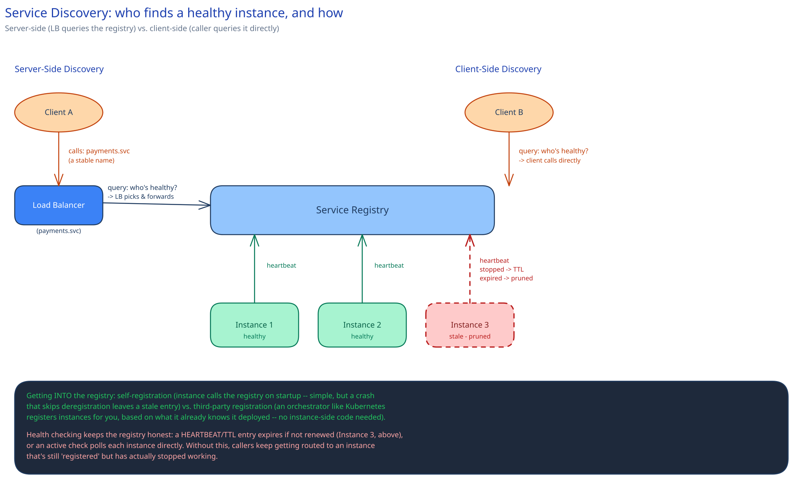

# Service Discovery

## What problem this solves

Any system with more than a handful of instances — autoscaling up and down, rescheduled onto new hosts after a failure, replaced on every deploy — can't afford to hardcode "the payments service is at 10.0.4.17." That address is stale within minutes. Service discovery is how a caller finds a *current, healthy* address for a service it wants to call, without baking any specific instance's location into code or config.

This isn't a replacement for [load balancing](../hld-building-blocks/load-balancing.md) — it's the layer underneath it. A load balancer distributes traffic across a pool behind one stable address; service discovery is what tells the load balancer (or a client doing its own lookup) what that pool of *healthy* instances actually is right now. Without it, the load balancer's own pool config would go stale the same way a hardcoded IP would.

## Client-side vs. server-side discovery

**Server-side** is the common shape: the caller hits one stable name or address — a DNS entry, a load balancer's VIP — and something else resolves that to a live instance. The caller never talks to a registry and doesn't know one exists.

**Client-side** puts the lookup in the caller: it queries a service registry directly ("give me all healthy instances of payments-service"), then picks one itself, often with its own load-balancing logic. This adds a moving part to every single caller, but it skips an extra network hop through a central load balancer — a trade real systems make when that hop's added latency matters more than the operational simplicity of centralizing it.

## The registry, and how instances get into it

A service registry is only useful if it reflects what's actually running. Entries get in one of two ways:

- **Self-registration** — an instance, on startup, calls the registry: "I'm here, I'm payments-service, here's my address." Simple to reason about, but an instance that crashes without a graceful shutdown never gets to deregister, leaving a dead entry unless something else notices.
- **Third-party registration** — an orchestrator (Kubernetes' control plane, for instance) registers instances on the system's behalf, because it already knows exactly what it deployed and where. No instance-side registration code needed, and the source of truth about what's running lives in one place that was already going to track it anyway.

## Health checking is what keeps it honest

Being *registered* isn't the same as being *healthy*. The registry needs a way to notice an instance that's stopped working:

- **Heartbeat / TTL entries** — each instance renews its own entry on a short interval; miss enough renewals and the entry expires automatically (Instance 3 in the diagram above).
- **Active health checks** — the registry (or something feeding it) polls each instance directly, independent of whether the instance is cooperating.

Skip this and the registry drifts from reality: callers keep getting routed to an instance that's technically still listed but has actually stopped doing useful work — the exact failure mode a [circuit breaker](circuit-breakers-retries.md) downstream of a bad lookup would then have to absorb.

## Interviewer follow-ups

**What happens to in-flight requests to an instance that's being deregistered for a deploy?**
Deregistration should happen *before* the instance stops accepting new connections, not after — a graceful-shutdown sequence removes the registry entry first, then drains in-flight requests, then exits. Get the order backwards and new requests keep landing on an instance that's already going away.

**How would service discovery work across multiple regions or datacenters?**
Usually a registry per region, so a lookup defaults to local instances first (lower latency, no cross-region dependency for the common case), with cross-region fallback only when the local pool can't serve the request — the same locality argument this guide's [CDN](../hld-building-blocks/cdn.md) page makes for content.

**Is DNS actually a form of service discovery — what are its limits here?**
Yes, DNS-based routing is a legitimate server-side discovery mechanism, but DNS records carry a TTL that clients and resolvers cache — exactly the kind of caching this guide's [caching strategies](../hld-building-blocks/caching-strategies.md) page flags as a staleness/speed trade-off. A DNS TTL long enough to be efficient is also long enough to keep sending traffic to an instance that deregistered seconds ago, which is why systems that need discovery to react in seconds usually reach for a purpose-built registry instead of DNS alone.
