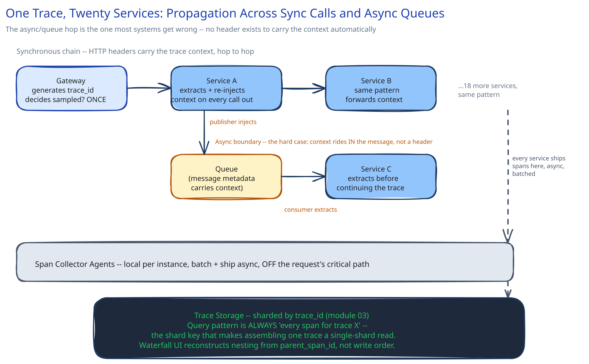

# Module 01 — Architecture & High-Level Design

## Requirements

Functional: give an engineer one view of every span belonging to one logical request, across every service it touched, including services reached asynchronously (via a queue), not just direct synchronous calls.

Non-functional (stated as assumptions, interview-style):

- Thousands of requests/sec, each touching ~20 services — a naive "trace everything in full" approach would mean storing and indexing an enormous span volume, most of which is never queried.
- Tracing overhead must not meaningfully add latency to the request path it's observing — the cure can't be worse than the disease.
- When something IS slow or erroring, the trace for that specific request must be available — sampling can't mean "the one time you needed it, it wasn't captured."

## Building blocks

| Block | Role |
|---|---|
| **Context Propagator** (a library, not a service) | Generates the trace ID at the edge; every service extracts it from the incoming request and re-injects it into every outgoing call, including queue messages |
| **Span Collector Agent** (sidecar/local process per service) | Batches spans locally and ships them off the request's own critical path, so tracing itself never blocks the request it's observing |
| **Sampling Decision Point** | Decides which requests get fully traced — see below, this is the actual design problem this module is about |
| **Trace Storage & Indexing Backend** | A store optimized for "give me every span with trace ID X," which is a very different access pattern than a relational query |
| **Trace Query / Waterfall UI** | Assembles stored spans back into the nested waterfall this guide's [Logs, Metrics & Distributed Tracing](../content/scalability-resilience/logs-metrics-tracing.md) page already shows |

## Per-path walkthrough

**Synchronous propagation (the easy 90%)** — `Gateway (generates trace ID) → Service A (extracts trace ID from header, injects into its own outgoing calls) → Service B → ... `. Cross-ref [API Gateway](../content/hld-building-blocks/api-gateway.md): the gateway is the natural place a trace ID is born, since every request already passes through it.

**Asynchronous propagation (the actually hard part)** — `Service A → publishes a message to a queue (cross-ref Message Queues & Pub/Sub) → Service C consumes it, potentially seconds or minutes later`. A queue message is not a synchronous call — there's no header to automatically carry forward unless the PUBLISHER deliberately embeds the trace context IN the message payload/metadata, and the CONSUMER deliberately extracts it before continuing the trace. Skip this and the trace silently breaks at every async boundary — exactly the kind of gap that makes "which service was slow" impossible to answer for any request that ever touches a queue.

**Sampling path** — the Sampling Decision Point runs at the edge, before most of the twenty services are ever called, so it's a decision made once per request, not per-service.

## Trade-offs to make explicit

| Decision | Chosen | Alternative | Why |
|---|---|---|---|
| Sampling strategy | Head-based (decide at the start) + tail-based override (always keep errors/slow requests) | Uniform random sampling only | Uniform sampling alone can miss the exact requests engineers care about most — a rare error might never land in a 1%-random sample; keeping every erroring/slow trace regardless of the sampling roll closes that gap |
| Where sampling is decided | Once, at the edge (head-based) | Each service independently decides whether to keep its own spans | Independent per-service decisions produce incomplete traces — if service 5 of 20 decides not to sample, the trace has a hole in it; one decision, propagated with the trace context, keeps the whole trace consistent |
| Span shipping | Async, batched, off the critical path | Synchronous write to the tracing backend before returning a response | A tracing backend hiccup must never become the reason the actual request is slow — cross-ref [Circuit Breakers & Retries](../content/scalability-resilience/circuit-breakers-retries.md)'s point about a monitoring dependency never gating the thing it observes |

## Load Handling

- **The tracing system's own load is proportional to total request volume across all 20 services**, not just one — at thousands of requests/sec x 20 spans/request, span volume is an order of magnitude above the request volume itself. This is the actual reason head-based sampling exists: keeping 100% of that volume, forever, at full detail, is a cost multiplier most systems can't justify for data almost never read.
- **Tail-based sampling's real cost**, named explicitly: deciding "keep this trace" only AFTER seeing whether it was slow/erroring means buffering every span from every service until the decision can be made — a genuinely more expensive architecture (a buffering collector layer) than head-based sampling's "decide once, upfront, and be done." Real systems often run head-based sampling as the default with a tail-based override specifically for errors/high latency, accepting the added collector cost only for the traces worth it.
- **Load-test target:** sustain full production span volume (thousands of requests/sec x 20 services) through the collector/shipping pipeline with zero measurable added latency on the traced requests themselves.

## Concurrent-User Handling

| Race | Mechanism | What the "loser" sees |
|---|---|---|
| Two services emit spans for the same trace ID at nearly the same wall-clock instant (normal concurrent execution across a fan-out) | Spans are independent, append-only records keyed by `(trace_id, span_id)` — there's no shared mutable state for concurrent spans to race over, so "concurrent" here isn't actually a hazard the way a shared counter would be | Nothing — both spans are stored and later assembled into the waterfall by timestamp/parent-span relationships, not by write order |
| A trace's sampling decision needs to be consistent even though many services check it independently | The decision (sampled: yes/no) is made ONCE at the edge and propagated as part of the trace context itself — every downstream service reads the same decision rather than each one deciding independently | N/A — this is a "no race by construction" answer: propagating the decision, rather than re-deciding per service, is what prevents this from ever being a race at all |

## Scaling & Reliability

- **Span Collector Agents** are local to each service instance and ship in batches — this is the mechanism that keeps tracing overhead off the request's own latency budget.
- **Trace Storage** scales as its own tier, typically sharded by trace ID (cross-ref [Data Partitioning & Sharding](../content/hld-building-blocks/data-partitioning-sharding.md)) since every read pattern is "give me all spans for this one trace ID" — a natural, even shard key.
- **Graceful degradation:** if the Trace Storage backend is down or overloaded, spans queue briefly at the collector and are dropped past a bounded buffer — losing some trace detail during an outage is an acceptable cost; blocking real traffic on a tracing-backend outage is not.

## What you'd revisit as this grows

- **Cross-team/cross-service trace-context conventions.** Twenty services owned by twenty different teams need to agree on the SAME propagation format (this is what standards like W3C Trace Context solve in practice) — a home-grown format that only half the services implement correctly produces exactly the broken-async-boundary problem this module names as the hard case.
- **Correlating traces with logs and metrics**, so a metric spike can jump directly to the specific traces that caused it — the three-signals story this guide's [Logs, Metrics & Distributed Tracing](../content/scalability-resilience/logs-metrics-tracing.md) page tells only pays off fully once they're cross-linked, which this module doesn't build out.
