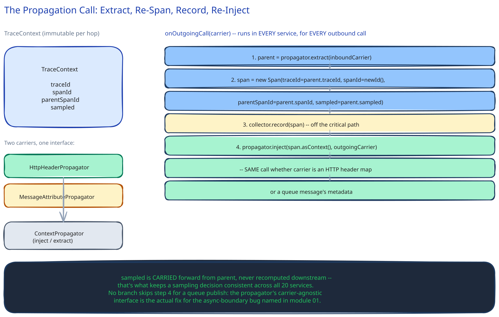

# Module 02 — Low-Level Design



## The two components worth designing carefully

Everything else is either "call a library" or "a batching client." Two pieces have a real design decision inside them: the context propagator (because it has to survive an async boundary, not just a synchronous call chain) and the sampler (because "sampled: yes/no" has to be decided once and honored consistently by every one of twenty services).

- **`TraceContext`** *(value object)* — `{traceId, spanId, parentSpanId, sampled}`. Immutable per hop: each service reads the incoming context, creates its OWN new `spanId` with `parentSpanId` set to the one it received, and passes that new context forward. This is what turns twenty independent calls into one connected tree instead of twenty flat, unrelated spans.
- **`ContextPropagator`** *(interface)* → **`HttpHeaderPropagator`** for synchronous calls, **`MessageAttributePropagator`** for queue publishes — both implement the same `inject(context, carrier)` / `extract(carrier) → context` contract, just against a different carrier (HTTP headers vs. message metadata).
- **`Sampler`** *(interface)* → **`HeadSampler`** (a probability check, run once at the edge) with a **`TailOverride`** that forces `sampled: true` regardless of the head decision whenever a span later reports an error or exceeds a latency threshold.
- **`SpanCollectorAgent`** — buffers spans locally, flushes in batches on a timer or size threshold, never on the request's own thread.

### Pseudocode for the two calls that matter

```
# At the edge (gateway) — the ONLY place a trace begins
onIncomingRequest(request):
    context = TraceContext(traceId=newId(), spanId=newId(), parentSpanId=null,
                            sampled=headSampler.decide())   # decided ONCE, never re-decided downstream
    httpPropagator.inject(context, request.outgoingHeaders)
    forwardTo(nextService, request)

# Inside any of the twenty services, for ANY outgoing call
onOutgoingCall(carrier, isQueuePublish):
    parent = propagator.extract(inboundCarrier)             # never null past the edge
    span = Span(traceId=parent.traceId, spanId=newId(), parentSpanId=parent.spanId,
                sampled=parent.sampled)                      # sampled is CARRIED, never recomputed
    collector.record(span)                                   # off the critical path — see module 01
    propagator.inject(span.asContext(), carrier)              # same call whether carrier is an HTTP header map
                                                               # or a queue message's metadata — same interface,
                                                               # different carrier is the whole point
```

Note what's deliberately absent: no branch that skips propagation for queue publishes. That branch not existing is the fix for module 01's "actually hard part" — the propagator's interface is carrier-agnostic specifically so a service can't accidentally forget to propagate just because this particular outgoing call happens to be a queue publish instead of an HTTP call.

### The one failure case worth designing for deliberately

If a service receives a request with NO trace context at all (a misconfigured caller, or a system boundary this tracing rollout hasn't reached yet), the propagator doesn't throw — it manufactures a fresh `TraceContext` as if this hop were the edge. The trace is shorter than it should be (missing the caller's spans), but the service's own and downstream spans are still captured and connected, rather than the whole request silently producing zero trace data because one upstream caller wasn't instrumented yet.

## The pattern you just used, named

**Strategy pattern**, same as this guide's [Catching Fraud in the Time It Takes to Approve a Payment](../fraud-detection-latency/02-lld.md) module — `HttpHeaderPropagator` and `MessageAttributePropagator` are interchangeable strategies behind one `ContextPropagator` interface, which is exactly what lets a service call `propagator.inject()` without a special case for "but this one's a queue."

## Practice: extend it yourself

Before moving to module 03, sketch how you'd add a THIRD carrier type: a scheduled batch job that reads a table row written by one of these twenty services and, hours later, kicks off further processing. Does `TraceContext` still make sense to propagate across that gap, and if the row itself is the only place to carry it, what does `inject`/`extract` look like against a database row instead of a header or a message?
