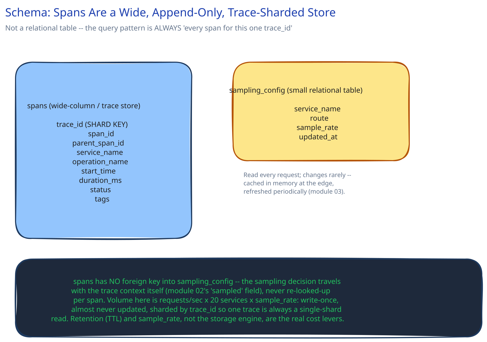

# Module 03 — Database Design

## From entities to schema

Two things need somewhere to live, and — same lesson this guide keeps repeating in every module that has both a hot path and a durable record — they have genuinely different storage needs.

- **`spans`** — one row per span: `trace_id`, `span_id`, `parent_span_id`, `service_name`, `operation_name`, `start_time`, `duration_ms`, `status`, plus a small set of key-value tags. Enormous volume (thousands of requests/sec x 20 services x sampling rate), write-once, almost never updated. This is a wide-column / trace-store shape (the same family as time-series stores), not a relational table with foreign-key joins — cross-ref [SQL vs NoSQL](../content/database-design/sql-vs-nosql.md)'s point that the query pattern decides the store, and the ONLY query pattern here is "give me every span with this exact `trace_id`."
- **`sampling_config`** — a handful of rows: which services/routes get what head-sampling rate, tunable without a redeploy. Read constantly (every request checks it) but changes rarely, so — same pattern as `fraud_rules` in [Catching Fraud in the Time It Takes to Approve a Payment](../fraud-detection-latency/03-db-design.md) — it's cached in memory at the edge and refreshed periodically, never queried per-request.

## Why `spans` is never a normal relational table

A relational table wants a small number of writes with rich relationships to query across (joins, foreign keys, transactions). `spans` is the opposite: a firehose of narrow, independent, append-only rows whose only relationship (`parent_span_id`) is reconstructed at READ time by the query UI, not enforced or joined at write time. Forcing this volume through row-level relational writes (and the indexing overhead that comes with a general-purpose relational engine) would make the tracing system itself a bottleneck under exactly the load spikes it's supposed to help diagnose — the same "don't let the observability tool become the thing that's slow" principle this guide's [Logs, Metrics & Distributed Tracing](../content/scalability-resilience/logs-metrics-tracing.md) page names for logs and metrics generally.

## Indexes and the shard key

- **`spans(trace_id)`** — not really an "index" so much as THE partition/shard key (cross-ref [Data Partitioning & Sharding](../content/hld-building-blocks/data-partitioning-sharding.md)). Every span belonging to one trace lands on the same shard, so assembling a full trace is a single-shard read, never a scatter-gather across the whole cluster.
- **`spans(service_name, start_time)`** — secondary, for the other real query pattern: "show me slow spans from THIS service over the last hour," used for service-level dashboards rather than single-trace lookups.
- **`sampling_config(service_name, route)`** — small table, composite key is just the natural lookup, no scaling concern here at all.

## Scaling the schema

- **`spans`** scales by adding shards keyed on `trace_id` hash, and separately by TTL — most tracing backends age out full-detail spans after days-to-weeks and keep only aggregated summaries beyond that, since the value of a single trace decays fast once the incident it was captured for is resolved.
- **Retention is a cost lever, not just a cleanup task.** Because volume is `requests/sec x 20 services x sampling rate`, the sampling rate and the retention window are the two knobs that actually control this store's cost — tuning either is cheaper than trying to make the storage engine itself faster.
- **`sampling_config`** doesn't scale in any interesting way — same observation this guide's fraud-detection module makes about its own small config table: noticing a table DOESN'T need sharding is as much a skill as sharding the ones that do.
