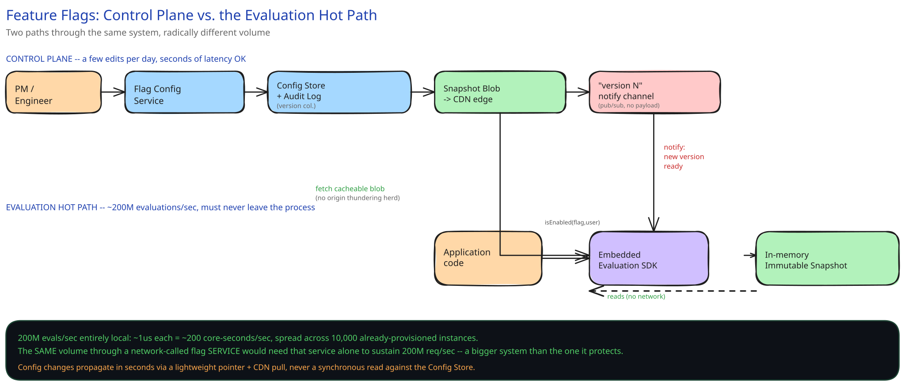

# Module 01 — Architecture & High-Level Design

**Diagram for this module:** 

## Requirements (stated, not guessed)

**Functional:**
- Toggle a feature on/off instantly for all users (kill switch).
- Roll out a feature to a percentage of users, with the same user consistently getting the same variant on every request.
- Target specific users or segments (internal employees, a beta list) that override the percentage rollout.
- A config change should propagate globally within seconds, with no code deploy.

**Non-functional:**
- **Scale:** assume 10,000 app-server instances platform-wide, each handling ~1,000 req/sec, evaluating an average of 20 flags per request → roughly **200M flag evaluations/sec** platform-wide.
- **The number that actually matters:** flag EVALUATION happens on the hot path of nearly every request. At this volume, evaluation cannot cost a network round-trip, a database query, or even a remote cache lookup — it must be a local, in-process operation, on the order of microseconds.
- **Writes are rare by comparison:** a handful of flag edits per day, platform-wide. This is one of the most extreme read:write ratios this guide's case studies cover.
- **Failure mode:** if the config-distribution pipeline goes down, every instance must keep serving its last-known-good configuration rather than failing open, failing closed, or crashing — an outage in the flag system must never become an outage in every OTHER feature the flags control.

## Monolith vs. microservices

The **Flag Config Service** (the control plane where a PM edits a rollout percentage) is a small, standalone service — but it is emphatically NOT in the request path of the application traffic it controls. This is the split worth stating explicitly: most services in this guide separate a write path from a read path for scaling reasons; here, the write-side control plane and the read-side evaluation are so different in volume (a few edits/day vs. hundreds of millions of evaluations/sec) that they don't just scale differently, they don't even run in the same process anywhere — evaluation happens inside a small SDK embedded in every OTHER service, not by calling the Flag Config Service at all.

## Building blocks

| Block | Role |
|---|---|
| **Flag Config Service** | Control plane; where a flag's rules, rollout percentage, and enabled state are edited |
| **Config Store** — small relational DB | Durable source of truth for flag definitions; low write volume, low row count |
| **Versioned snapshot store** (CDN / blob storage) | Holds the full flag config as one immutable, versioned blob per version |
| **Change-notification channel** (pub/sub) | A lightweight "version N is now live" signal fanned out to every app instance — carries no payload, just a pointer |
| **Embedded evaluation SDK** (in every app service instance) | Holds the current snapshot in memory; evaluates every flag check locally, in-process |
| **Audit log** | Append-only record of every flag change — who, what, when |

## Per-path walkthrough

**Config-change path (rare, low-volume)** — `PM/Engineer → Flag Config Service → Config Store (write) + Audit Log (append) → publish new versioned snapshot to blob storage → publish "version N" event to the change-notification channel`. This entire path runs a handful of times a day and has no hard latency requirement beyond "reasonably fast" — seconds, not milliseconds.

**Config-propagation path (fan-out to thousands of instances)** — `Change-notification channel → every app instance's embedded SDK` — each instance receives the lightweight "new version" signal, fetches the small versioned blob from the CDN (cross-ref [CDN](../content/hld-building-blocks/cdn.md)), and atomically swaps its in-memory snapshot. Fetching from a CDN edge rather than the origin Config Store is what prevents 10,000 instances refreshing simultaneously from becoming a thundering herd against one small database.

**Evaluation path (the hot path, no network hop at all)** — `Application code → SDK.isEnabled(flagKey, userContext)` — reads the ALREADY-IN-MEMORY snapshot, applies targeting rules, computes a deterministic hash-based bucket, and returns a boolean. This is the path that runs 200M times/sec, and it never leaves the process it's called from.

## Back-of-envelope math

- 200M evaluations/sec platform-wide, entirely in-process: at even a generous 1 microsecond per evaluation (a hash + a handful of comparisons), that's 200 CPU-core-seconds of work per second spread across 10,000 already-provisioned instances — genuinely negligible marginal cost, which is the entire point of choosing local evaluation.
- Contrast: routing those same 200M evaluations/sec through a centralized flag-checking SERVICE over the network — even at an optimistic 1ms round-trip — would require that service alone to sustain 200M req/sec, an entirely different (and far more expensive) system than the application traffic it's meant to support.
- Config payload size: even a large flag system (thousands of flags, complex targeting rules) serializes to a config blob in the low megabytes — trivially cheap to distribute via CDN edge caching to 10,000 instances, compared to serving 200M/sec of individual evaluation requests from a origin.

## Trade-offs

| Decision | Chosen | Alternative | Why |
|---|---|---|---|
| Evaluation location | Local, in-process (embedded SDK) | Centralized flag-checking service, called over the network | At 200M evals/sec, a network hop per evaluation is not just slower — it's a different, far more expensive system than the one being protected |
| Config distribution | Push (pub/sub "new version" signal) + CDN-fetched blob | Poll — every instance periodically calls the Config Store directly | A poll interval short enough to feel "instant" for a kill switch (seconds) at 10,000 instances would hammer the origin store constantly; push notifies only WHEN something changed |
| Rollout mechanism | Deterministic hash of (flag key, user ID) | Random assignment per request, or a stored per-user assignment row | Determinism gives "same user, same experience" for free, with no per-user storage at all; random assignment would make the UI flicker between variants on every request |
| Config update propagation speed | Seconds (pub/sub fan-out + CDN cache) | Immediate/synchronous (every evaluation reads live from the Config Store) | A kill switch needs to feel fast, but doesn't need to be transactionally synchronous with the edit — a few seconds of propagation lag is an acceptable, explicitly stated trade for keeping evaluation entirely local |
| Failure mode on distribution outage | Serve last-known-good snapshot | Fail closed (treat all flags as disabled) or fail open (treat all as enabled) | Neither blanket failure mode is safe — a payments-gating flag failing open, or a critical-feature flag failing closed, could each be worse than the outage itself. Freezing at "whatever was last confirmed good" is the only choice that doesn't guess |

## Load handling

- **Evaluation load is a non-problem by construction:** since evaluation never leaves the calling process, a 10x traffic spike on the application doesn't touch the flag system's control plane, config store, or distribution pipeline at all — it's absorbed by whatever capacity already exists for the application traffic itself.
- **The real load concern is distribution fan-out:** a config change needs to reach 10,000 instances without a thundering herd. The change-notification channel carries only a small "version N" pointer, not the payload — instances then pull the actual (cacheable, immutable) blob from a CDN edge, which is built to absorb exactly this kind of fan-out read pattern (cross-ref [CDN](../content/hld-building-blocks/cdn.md)).
- **Backpressure isn't really the right frame here** — there's no request queue to shed load from on the evaluation path, because evaluation is a function call, not a request. The closest analogue is rate-limiting how often the CONTROL PLANE itself accepts edits, to prevent a scripting error from publishing thousands of config versions per second and flooding the notification channel — a very different, much smaller-scale problem than the application's own traffic.

## Concurrent-user handling

| Race | Mechanism | What the "loser" sees |
|---|---|---|
| Two engineers editing the same flag's rollout percentage at the same instant | Optimistic concurrency — the Config Store's write is a compare-and-swap on a `version` field | The second writer's save is rejected with "this flag changed since you loaded it," not silently overwritten — same principle as [Optimistic Concurrency Control](../content/database-design/optimistic-vs-pessimistic-locking.md) |
| A config refresh landing mid-evaluation on one app instance | The SDK swaps a POINTER to an entire new immutable snapshot object, never mutates fields of the currently-in-use one | An in-flight evaluation either sees the fully-old or fully-new snapshot — never a half-updated one with some old fields and some new |
| Same user evaluated on two different app instances at the same moment (different servers, different processes) | Both instances hash the identical `(flag_key, user_id)` pair through the identical deterministic function | Both instances compute the identical bucket independently — this is the real "concurrency" story here: consistency by determinism, not by coordination between the two instances |
| A flag's targeting rule references a user segment that's still being backfilled | The SDK treats an unresolvable/unparseable rule as "fall through to the percentage rollout" rather than erroring the whole evaluation | The user gets the default rollout behavior rather than a crashed request — an evaluation must never fail loudly on the hot path |

## What you'd revisit as this grows

- **Per-flag evaluation analytics** (how many users actually saw variant A vs. B) needs its own event-logging path, which itself must stay strictly async and off the hot path — the same "don't let observability slow down the thing being observed" principle this guide's other case studies apply to logging.
- **Multi-region propagation latency** — this design assumes one global change-notification channel; a genuinely global platform would want regional distribution tiers so a kill switch in one region doesn't wait on a cross-continent hop, at the cost of a brief window where regions can disagree.
- **Gradual automatic rollback** — tying a rollout percentage to an error-rate metric (auto-pause a rollout if the new variant's error rate spikes) is a natural next step this design doesn't build, but the versioned-snapshot mechanism already supports it: an automatic rollback is just another config write.
