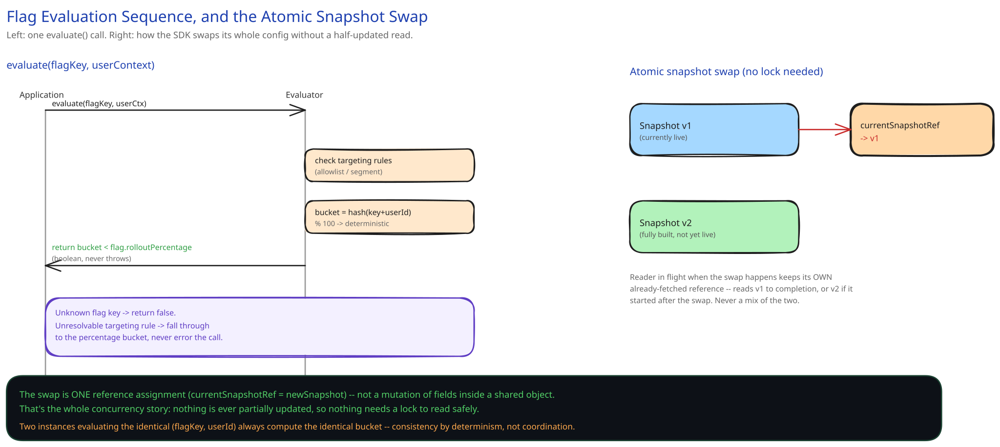

# Module 02 — Low-Level Design

**Diagram for this module:** 

## The two components worth designing carefully

Everything else in this feature is "store a row, fetch a row." These two are not:

1. **The evaluator** — given a flag key and a user context, decide on/off deterministically, in-process, in microseconds.
2. **The snapshot swap** — how the embedded SDK replaces its entire in-memory config without ever serving a half-updated read.

## Interfaces vs. implementations

- **`FlagEvaluator`** *(interface)* → **`DeterministicHashEvaluator`** — `evaluate(flagKey, userContext) -> bool`. Owns no state itself; takes the current snapshot as an argument so it never has a stale-vs-fresh question of its own.
- **`ConfigSnapshot`** *(interface)* → **`ImmutableSnapshot`** — a fully-built, read-only object: every flag's rules, compiled once when the snapshot is constructed, never mutated after. This immutability is the entire concurrency story (see below).
- **`SnapshotSource`** *(interface)* → **`CdnPolledSnapshotSource`** — fetches a new snapshot blob when notified, builds an `ImmutableSnapshot` from it, and atomically swaps the SDK's reference to "current."

### Pseudocode for the two methods that matter

```
Evaluator.evaluate(flagKey, userContext, snapshot):
    flag = snapshot.flags[flagKey]
    if flag is null:
        return false                              # unknown flag: default off, never throw

    for rule in flag.targetingRules:                # allowlist / segment rules, evaluated first
        if rule.matches(userContext):
            return rule.resultOverridesRollout       # explicit targeting wins over the percentage math
        if rule.isUnresolvable(userContext):
            continue                                 # fall through, never fail the whole evaluation

    bucket = hash(flag.key + userContext.userId) % 100   # deterministic: same inputs, same bucket, always
    return bucket < flag.rolloutPercentage

SDK.onNewVersionNotified(versionId):
    blob = cdn.fetch(versionId)                      # cacheable, immutable once published
    newSnapshot = ImmutableSnapshot.build(blob)       # fully constructed before anyone can see it
    this.currentSnapshotRef = newSnapshot             # single pointer swap — atomic, no partial state
```

Two things worth naming as deliberate, not incidental:

- **Unknown flag defaults to `false`, not an exception.** A typo'd flag key on the hot path must degrade to "feature off," never crash the request calling it.
- **The snapshot is built completely before it's published.** `currentSnapshotRef` only ever points at a fully-formed object — there's no window where a reader sees a snapshot with some flags parsed and others not.

## Concurrency, at the code level

The race this guide's HLD module names — "a config refresh landing mid-evaluation" — is enforced right here, in `onNewVersionNotified`: the swap is a single reference assignment, not a mutation of fields inside the currently-live snapshot object. Any evaluation already holding a reference to the old snapshot keeps reading it, undisturbed, until it naturally finishes; the very next call to `evaluate` after the swap reads the new one. No lock is needed because there's nothing shared to lock — old and new are two separate, fully-immutable objects, and only the pointer changes.

This is in-process only, deliberately: each app-server instance holds its own snapshot reference, so there is no cross-instance mutex to reason about here — that determinism (same hash, same bucket, everywhere) is what the HLD module means by "consistency by determinism, not by coordination."

## Design patterns you just used, named

- **Strategy** — `FlagEvaluator` behind an interface means the hashing/bucketing algorithm could be swapped (e.g. a different rollout math for a different flag type) without touching call sites.
- **Immutable snapshot / copy-on-write** — the swap-a-pointer-not-a-field approach is the same technique a lock-free read path always reaches for: never mutate what a reader might be holding.

## Practice: extend it yourself

Before moving to module 03, sketch how you'd add a **"kill this flag for one specific region only"** rule. Which layer does that belong in — the targeting rule (checked before the percentage math), or a separate pre-check? (Hint: it's targeting-rule shaped — it's just another condition that can override the rollout, the same way the allowlist rule already does.)
