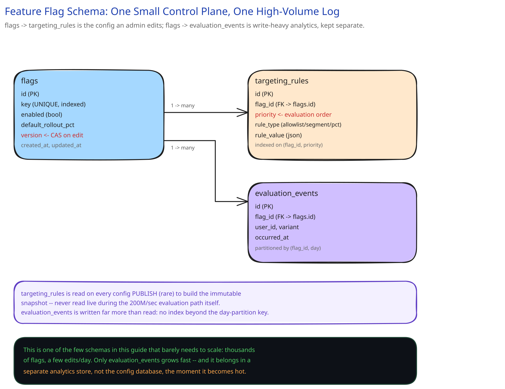

# Module 03 — Database Design

**Diagram for this module:** 

## From requirements to schema

This module's whole design already told you the write side is tiny and the read side never touches a database at all — so the schema exists to serve the CONTROL PLANE (a human editing a flag), not the 200M/sec evaluation path. Three entities:

- **`flags`** — one row per feature flag: key, description, enabled state, default rollout percentage, current `version`.
- **`targeting_rules`** — one row per explicit rule on a flag (allowlist, segment match, percentage override), ordered and evaluated before the default rollout math.
- **`evaluation_events`** — a row (or, in practice, a batched/sampled stream) recording which variant a user saw, for analytics — explicitly NOT on the hot path (module 01 already names this as async, off-path logging).

## Why `flags.version` is the one column everything else depends on

Every design decision in this feature — the CDN-cacheable immutable snapshot, the compare-and-swap edit conflict check, the "which config is live right now" pointer — is really just different consumers reading the same `version` field. A flag edit is, underneath, `UPDATE flags SET ..., version = version + 1 WHERE id = ? AND version = ?` (the `AND version = ?` is the optimistic-concurrency check from module 02's HLD trade-off table: the write fails outright if someone else edited it first, rather than silently clobbering their change).

## Indexes, tied to the only queries that actually run

- **Unique index on `flags.key`** — every evaluation and every edit looks a flag up by its human-readable key, never by an internal numeric ID a PM would need to know.
- **Index on `targeting_rules.flag_id`, ordered by an explicit `priority` column** — rules must be evaluated in a defined order (allowlist before segment before falling through to the rollout percentage), so the ordering is a real column, not an accident of insertion order.
- **No index on `evaluation_events` beyond a coarse `(flag_id, day)` partition key** — this table is written far more than it's read, and reads are aggregate analytics ("what % saw variant B this week"), not point lookups; over-indexing a write-heavy, rarely-point-queried table would be pure write-tax (cross-ref [Database Indexing](../hld-building-blocks/database-indexing.md)'s point about indexes you don't need).

## What deliberately does NOT live in a row

The actual in-memory `ImmutableSnapshot` module 02 evaluates against is never reconstructed from these tables live — it's built once, when a version is published, and shipped as one versioned blob. The tables above are the source of truth an admin edits and audits; the snapshot is a compiled, denormalized artifact derived from them, the same "denormalize the hot read path" move this guide's [E-Commerce Schema](../database-design/ecommerce-schema-worked-example.md) module makes for `orders.total_amount` — except here the "denormalized copy" is an entire in-memory object graph, not one column.

## Scaling this schema

This is one of the few case studies in this guide where the honest answer is **it barely needs to scale at all**: thousands of flags, a handful of edits a day, and an audit log growing at human-editing speed — comfortably within a single small relational instance for the lifetime of most companies. The only genuinely high-volume table is `evaluation_events`, and the right move there is the same one [Data Partitioning & Sharding](../hld-building-blocks/data-partitioning-sharding.md) points at elsewhere in this guide: stream it into a separate analytics store built for high-volume appends, rather than trying to make the primary flag-config database absorb both workloads.
