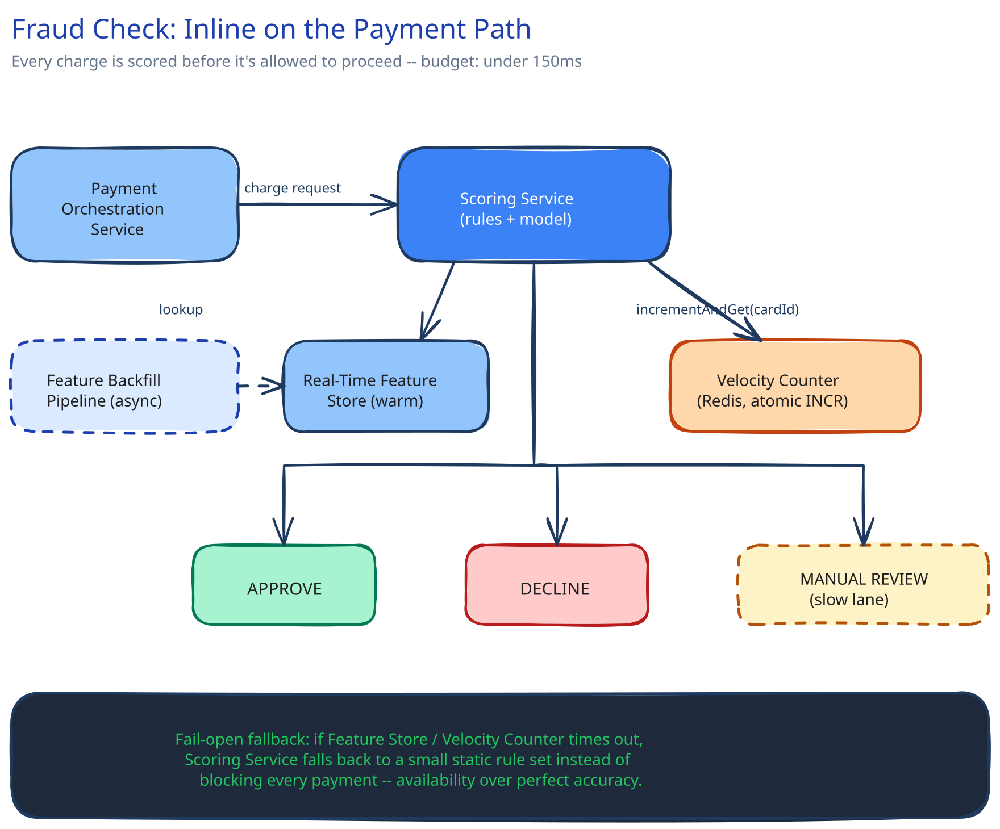

# Module 01 — Architecture & High-Level Design

## Requirements

Functional: score every charge request for fraud risk before the payment is allowed to proceed, using signals like recent transaction velocity for this card/account, device-fingerprint reputation, and whether this location matches the account's usual pattern.

Non-functional (stated as assumptions, interview-style):

- The scoring decision must complete in **under 100–200ms** — a fraction of the payment's own end-to-end budget from [Payments System](../content/case-studies/payments-system/00-overview.md), not a separate, slower path bolted alongside it.
- Runs at the same throughput as the payment system itself (~2,900/sec peak per that module's capacity estimate).
- Dozens of signals evaluated per transaction, most of which are themselves aggregates ("how many charges has this card attempted in the last 10 minutes") too expensive to compute fresh on every request.

## Building blocks

| Block | Role |
|---|---|
| **Real-Time Feature Store** | Keeps per-card/per-account signals (velocity counters, device reputation, geo-pattern) pre-computed and warm, so a lookup at decision time is O(1), not a live aggregation query |
| **Scoring Service** (stateless) | Combines the fetched features through a rules engine and/or a lightweight model call, returns a risk score inside the latency budget |
| **Risk-Tier Router** | Maps the score to one of three exits: auto-approve, auto-decline, or route to a slower manual/secondary review — explicitly off the fast path |
| **Velocity Counter Store** (Redis-class) | The specific feature that has to be *write-then-immediately-readable*: how many attempts has this card made in the last N minutes, updated atomically on every attempt |
| **Feature Backfill Pipeline** | Asynchronously recomputes slower-moving features (device reputation, historical geo-pattern) from transaction logs, keeping the feature store warm without sitting in the request path |

## Per-path walkthrough

**Scoring path (the fast path, >95% of traffic)** — `Payment Orchestration Service → Scoring Service (feature-store lookup, rules/model evaluation) → risk tier "low" → auto-approve, decision returned inside budget`. The feature-store lookup is the entire reason this is fast: every expensive aggregate was already computed before this request arrived.

**Decline path** — same lookup, risk tier "high" → auto-decline, returned just as fast as approval. A decline is not slower than an approval; both are the same lookup-and-route, just a different threshold crossed.

**Manual-review path (the deliberately slow lane)** — risk tier "borderline" → the payment is held (or approved provisionally, depending on the business's risk appetite) and queued for a secondary check that can take seconds to hours — explicitly **not** blocking the fast path's latency budget for the common case; this is the release valve for the signals that are genuinely ambiguous.

## Trade-offs to make explicit

| Decision | Chosen | Alternative | Why |
|---|---|---|---|
| When scoring happens | Inline, before the payment is allowed to complete | After the fact, as a batch job scanning recent transactions | By the time a batch job would catch it, the money has already moved — this only works for a payment system because the check rides the same request, not a separate pipeline |
| Feature computation | Pre-computed, kept warm in a fast store | Computed live at decision time from raw transaction history | A live aggregation query against transaction history for every payment would itself blow the latency budget this module exists to protect |
| Borderline outcomes | Route to a slower manual/secondary path | Force every transaction through a single fast/slow binary | Forcing a binary either lets too much genuine fraud through (loose threshold) or declines too many legitimate purchases (tight threshold) — a third lane absorbs the genuinely ambiguous cases without either cost |

## Load Handling

- **This runs on the exact same critical path as every payment** — its own latency and availability directly cap the payment system's. There is no "just retry it later" for a synchronous fraud check.
- **Fallback if the Scoring Service is slow or times out:** fail open to a more conservative default rule set (a small number of hard rules — velocity over an absolute threshold, a handful of known-bad signals) rather than fail closed and block all payments outright. Cross-ref [Latency, Throughput & the CAP Theorem](../content/foundations/latency-throughput-cap.md): this is explicitly an availability-over-perfect-accuracy choice, because blocking every payment because the fraud service hiccuped is a worse business outcome than temporarily running looser rules.
- **The timeout that makes this possible at all:** cross-ref [Circuit Breakers & Retries](../content/scalability-resilience/circuit-breakers-retries.md) — a deliberately aggressive timeout on the Scoring Service call, well inside the payment's own budget, so a caller can tell "answered" from "too slow to wait for" and fall back cleanly instead of the whole payment hanging.
- **Load-test target:** sustain 3,000 scoring decisions/sec for 10 minutes with p99 latency under 150ms and zero requests silently dropped (every request gets a tier, even if that tier is the conservative fallback).

## Concurrent-User Handling

| Race | Mechanism | What the "loser" sees |
|---|---|---|
| Rapid repeated attempts from the same compromised card, arriving concurrently, before the first attempt's velocity signal has been written back | An atomic increment-and-check against the Velocity Counter Store (the same distributed-counter mechanism [Rate Limiting](../content/hld-building-blocks/rate-limiting.md) uses for API quota, applied here to fraud velocity) — every concurrent attempt increments the *same* counter atomically, so the 3rd attempt in a burst sees the true count of 3, not a stale 1 | Each attempt gets a score reflecting the true count at that instant; the card crosses the velocity threshold and starts getting declined as soon as the real count — not a delayed one — crosses it |
| Two concurrent attempts on the same card land in different Scoring Service instances at nearly the same moment | Both read and increment the same shared counter store (not a per-instance local counter) — cross-ref [Consistency Models](../content/hld-building-blocks/consistency-models.md)'s point that a per-instance count would let a client evade a shared limit by hitting different instances | Neither request has an advantage; both see the shared, true state |

## Scaling & Reliability

- **Horizontal scaling:** Scoring Service instances are stateless and scale behind the payment path by request rate; the Real-Time Feature Store and Velocity Counter Store scale as their own tier, sharded by card/account id (cross-ref [Data Partitioning & Sharding](../content/hld-building-blocks/data-partitioning-sharding.md)) so one hot card can't create a hot shard for every other card.
- **Circuit breaker + fail-open:** covered above — the one piece of reliability design this module is actually about.
- **Graceful degradation:** the Feature Backfill Pipeline falling behind degrades scoring *accuracy* (features go slightly stale) without ever blocking the fast path — a deliberate, bounded staleness, the same trade this guide's caching pages make repeatedly.

## What you'd revisit as this grows

- **Model retraining and drift.** A static rules engine ages as fraud patterns shift; a mature system retrains its model regularly and monitors for the score distribution itself drifting, which this module doesn't take on.
- **Cross-account and cross-merchant signals.** A single compromised card is the easy case; a ring of coordinated accounts hitting many merchants at once needs signals this per-card feature store doesn't capture on its own.
- **Feedback loop from confirmed fraud/chargebacks** — closing the loop from "this was later confirmed fraudulent" back into the feature store and rules is a real system's actual source of improving accuracy over time, deliberately out of scope here.
