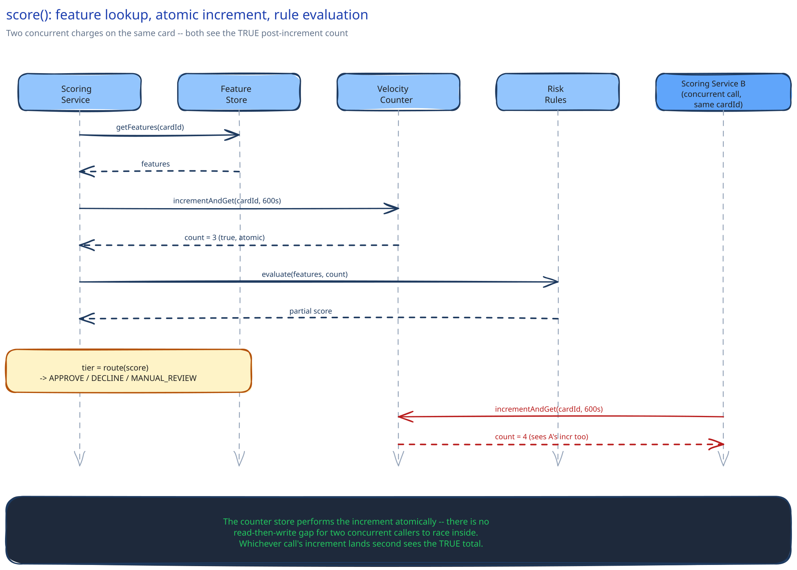

# Module 02 — Low-Level Design



## The two components worth designing carefully

Everything else in module 01 is a fairly ordinary stateless service. Two pieces actually have a real design decision inside them: the velocity check (because it has to be correct under concurrency, not just fast) and the risk-tier router (because "borderline" is a real branch, not an afterthought).

- **`VelocityCounter`** *(interface)* → **`RedisVelocityCounter`** — `incrementAndGet(cardId, windowSeconds)`. A single atomic operation (a Redis `INCR` with an expiring window key, or an equivalent atomic increment-and-read) — never a separate read-then-write, which is exactly the kind of check-then-act race this guide's [Idempotency Keys](../content/scalability-resilience/idempotency-keys.md) module warns about in a different context.
- **`FeatureStore`** *(interface)* → **`WarmFeatureStore`** — `getFeatures(cardId, accountId, deviceId)`. Pure read against pre-computed data; never falls back to a live aggregation query, by design (module 01's whole premise).
- **`RiskRule`** *(interface)*, many implementations (velocity threshold, device reputation, geo-mismatch) — each takes the fetched features and returns a partial score contribution. Adding a new signal means adding a new `RiskRule` implementation, not editing a monolithic scoring function.
- **`RiskTierRouter`** — takes the combined score, returns one of `APPROVE` / `DECLINE` / `MANUAL_REVIEW`.

### Pseudocode for the call that matters

```
ScoringService.score(chargeRequest):
    features = featureStore.getFeatures(chargeRequest.cardId, chargeRequest.accountId, chargeRequest.deviceId)
    velocity = velocityCounter.incrementAndGet(chargeRequest.cardId, windowSeconds=600)
                                                # ^ atomic — every concurrent caller sees the TRUE post-increment count

    score = 0
    for rule in riskRules:
        score += rule.evaluate(features, velocity, chargeRequest)

    tier = riskTierRouter.route(score)
    return tier                                 # APPROVE / DECLINE / MANUAL_REVIEW, always inside the latency budget
```

Note what's deliberately absent: no branch that writes to the primary payments database, no branch that calls another synchronous service. The scoring call's entire cost is one feature-store read and one atomic counter increment — that's what keeps it inside budget even under peak load.

### The one failure case worth designing for deliberately

If the `FeatureStore` or `VelocityCounter` call itself times out (not "returns a low score" — actually fails to answer), the caller (module 01's Scoring Service wrapper) catches this and falls back to the conservative static rule set rather than propagating the failure up into the payment path. This is the code-level home of module 01's Load Handling section — the fallback isn't a vague policy, it's a specific `catch` block with a specific, smaller rule set as its fallback path.

## The pattern you just used, named

**Strategy pattern** — each `RiskRule` is a strategy; the scoring service doesn't know or care which specific rules are wired in, only that each one implements `evaluate()`. Adding a signal for a new fraud pattern means adding a class, not touching the ones that already work.

## Practice: extend it yourself

Before moving to module 03, sketch how you'd add **a per-device daily spend cap** (not just a per-card velocity check, a cross-card limit tied to one physical device). Which existing interface does this fit into cleanly, and does it need its own counter store keyed differently than the card-keyed one already here?
