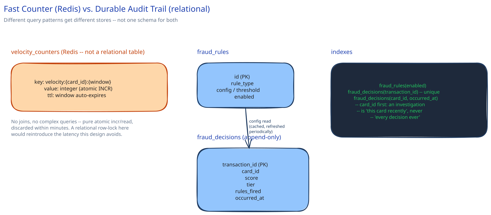

# Module 03 — Database Design

## From entities to schema

Three things need somewhere to live, and they have genuinely different storage needs — naming that explicitly is the actual content of this module:

- **`velocity_counters`** — not a relational table at all. Lives in the same Redis-class store as module 01's Velocity Counter Store: a key per `(card_id, window)`, a value that's just an integer, a TTL that expires the window automatically. Cross-ref [SQL vs NoSQL](../content/database-design/sql-vs-nosql.md)'s point that the right store follows the query pattern — this pattern is "atomic increment, read the current value, nothing else," which is exactly what a key-value store with atomic ops is built for and exactly what a relational table with row locks would handle worse under this write rate.
- **`fraud_rules`** — a small, low-write-volume relational table: rule id, rule type, threshold/config, enabled flag. Read on every scoring call but changes rarely (a human tunes a threshold occasionally), so it's cached in memory by the Scoring Service and refreshed periodically rather than queried per-request.
- **`fraud_decisions`** — one append-only row per scored transaction: transaction id, score, tier, which rules fired, timestamp. This is the audit trail and the training-data source for the "what you'd revisit" model-retraining note in module 01 — never updated after insert, only appended.

## Why `velocity_counters` is explicitly NOT in the same database as `fraud_decisions`

This is the one decision worth defending out loud. `fraud_decisions` needs durability and is queried later (for audits, for model training) — a relational store, or at least a durable log, is the right fit. `velocity_counters` needs neither: a lost counter on a crash just means one window's velocity count resets to zero, which is a minor accuracy blip, not a correctness bug, and the value is worthless the moment its TTL expires anyway. Paying relational-database write latency for a value that's read-modified thousands of times a second and discarded within minutes would reintroduce exactly the latency problem module 01 exists to avoid.

## Indexes tied to real queries

- `fraud_rules(enabled)` — the Scoring Service's periodic refresh only needs active rules; a small, rarely-changing table barely needs this, but it's free and matches the actual read pattern.
- `fraud_decisions(transaction_id)` — unique, the natural lookup for "show me why this specific charge was declined."
- `fraud_decisions(card_id, occurred_at)` — composite, same reasoning this guide's [Database Indexing](../content/database-design/database-indexing.md) module already uses for `click_events`: an investigation is almost never "every decision ever," it's "this card's recent decisions," so `card_id` first lets the index narrow before considering time range at all.

## Scaling the schema

- **`velocity_counters`** scales the way any hot key-value workload does: shard by `card_id` hash across the counter store's nodes (cross-ref [Consistent Hashing](../content/hld-building-blocks/consistent-hashing.md)) so no single node absorbs every card's traffic.
- **`fraud_decisions`** is append-only and grows fast (one row per transaction) — a strong candidate to move to a columnar/time-series store once volume justifies it, the same move this guide's [Database Replication & Failover](../content/database-design/db-replication-failover.md) module and the URL shortener's `click_events` module both make for their own high-write, rarely-updated tables.
- **`fraud_rules`** barely needs to scale at all — a handful of rows, read-cached in application memory. Noticing when a table *doesn't* need sharding is as much a skill as noticing when it does.
