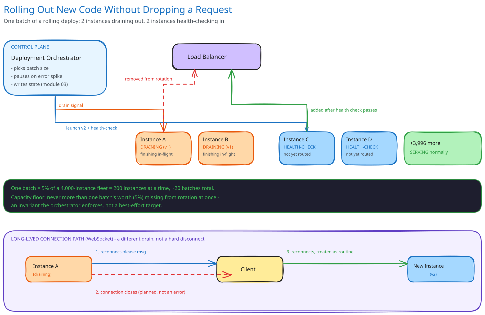

# Module 01 — Architecture & High-Level Design

## Requirements (stated, not guessed)

**Functional:**
- Replace every instance in a fleet with a new version, with no engineer manually touching individual servers.
- An in-flight request being served by an instance mid-replacement completes normally.
- A long-lived connection (a WebSocket) gets a chance to reconnect cleanly rather than seeing a hard disconnect as an error.

**Non-functional:**
- **Scale:** assume a fleet of 4,000 instances behind a load balancer, serving real production traffic throughout the rollout.
- **The hard requirement:** zero requests dropped *because of the deploy*, not "an acceptably small number." A request failing for an unrelated reason (a bug in the new code, a downstream outage) is out of scope for this module — that's canary analysis and rollback, a different problem.
- **Bounded rollout time:** the whole fleet should finish within roughly an hour, not "eventually" — a rollout that takes days leaves the fleet running two versions long enough for that skew itself to become a source of bugs.
- **Capacity floor:** total serving capacity must never dip below what current traffic needs, at any point during the rollout.

## Why the orchestrator is its own control-plane component

The natural instinct is to ask "monolith vs. microservices" the way this guide's other case studies do, but that's the wrong seam here — every instance in the fleet already runs whatever service architecture the rest of this guide covers. The seam that actually matters is between the **data plane** (the instances serving traffic) and a separate **control plane** (the orchestrator deciding which instances to replace, in what order, and when to pause). Folding rollout logic into each service itself would mean every service reimplements "how do I safely replace myself" — instead, one orchestrator (a deployment system, e.g. what Kubernetes' rollout controller does) owns that logic once, and every service it manages gets it for free by conforming to a small contract: expose a health-check endpoint, and shut down gracefully on a signal.

## Building blocks

| Block | Role |
|---|---|
| Load balancer | Routes live traffic; the actual gate that decides whether an instance receives new requests — cross-ref [Load Balancing](../content/hld-building-blocks/load-balancing.md)'s health-check framing |
| **Deployment orchestrator** (control plane) | Decides batch size, order, and pace; the only thing in this system that knows the rollout is happening |
| **Instance registry / rollout state store** | Durable record of which instances are on which version, and each one's current lifecycle state — module 03 covers this |
| App instances (data plane) | Run the actual service; expose a health-check endpoint and a graceful-shutdown signal handler |
| Connection-draining logic (per instance) | Stops accepting new connections immediately on shutdown signal, keeps the process alive until in-flight requests finish or a drain deadline passes |

## Per-path walkthrough

**Rolling replacement (the steady-state path)** — `Orchestrator → picks a small batch (e.g. 5% of the fleet) → removes those instances from the load balancer's rotation → signals graceful shutdown → waits for drain or timeout → terminates old instances → starts new-version instances → waits for each to pass its OWN health check → adds them back to rotation → next batch`. An instance is never touched while still receiving live traffic, and never re-added to rotation until it has proven itself healthy on the new version — cross-ref [Load Balancing](../content/hld-building-blocks/load-balancing.md)'s active-vs-passive health check distinction: this is the active kind, gating entry, not just detecting failure after the fact.

**Graceful shutdown (the in-flight-request path)** — the moment an instance is marked for replacement, it stops accepting new connections *immediately* but keeps its process running for a bounded drain window (e.g. 30 seconds) so any request it already accepted can finish normally. Only after every in-flight request completes, or the drain window expires (whichever comes first), does the orchestrator actually terminate it. This is the literal mechanism that makes "zero dropped requests" possible: the instance's death is delayed until it has nothing left to drop.

**Long-lived connection path (WebSocket)** — cross-ref [Long Polling, WebSockets & SSE](../content/scalability-resilience/long-polling-websockets-sse.md): a WebSocket can't just "finish" the way a quick HTTP request does — it might be open for hours. The drain step for this path is different in kind: the server sends the client an explicit "please reconnect" message *before* the connection is closed, so the client's own reconnect logic treats it as a planned, expected event (reconnect immediately, probably to a different, already-healthy instance) rather than an error to retry-with-backoff against.

## Back-of-envelope math

- 4,000 instances, replaced in batches of 5% (200 instances/batch) → 20 batches to cover the whole fleet.
- If each batch's drain-and-verify cycle takes ~3 minutes (30s drain + health-check warm-up + a safety buffer), 20 batches ≈ **60 minutes** for the full rollout — comfortably inside the bounded-time requirement.
- Capacity floor check: removing 200 of 4,000 instances at once is a 5% capacity dip — the batch size is deliberately chosen so this is well within the fleet's normal headroom (provisioned for traffic spikes anyway), not something that needs its own special-cased buffer.

## Trade-offs

| Decision | Chosen | Alternative | Why |
|---|---|---|---|
| Rollout shape | Small batches, sequential | Replace the whole fleet at once ("big bang") | A big-bang replacement means every instance is simultaneously unhealthy or warming up at some point — capacity drops to zero and a bug in the new version takes down 100% of traffic instantly, with no batch left un-deployed to fall back on |
| Batch size | Fixed percentage of fleet (e.g. 5%) | Fixed absolute count | A percentage scales with fleet size automatically; a fixed count either crawls on a huge fleet or dips capacity too far on a small one |
| Drain mechanism | Bounded timeout, not "wait forever" | Wait indefinitely for every in-flight request to finish | A single stuck/hung request would block that instance's termination forever, and the whole rollout behind it — a bounded deadline trades a vanishingly rare forced-drop of one pathological request for a rollout that can't stall indefinitely |
| WebSocket handling | Explicit reconnect-first signal | Just close the connection like any other drain | A raw close looks identical to a crash from the client's perspective, triggering error-handling/backoff logic instead of an instant, calm reconnect — the one-line signal is what keeps this a non-event for the user |

## Load handling

- **Peak-vs-average tolerance:** the batch size is the actual lever — capacity dips by exactly one batch's worth at any moment (5% in this example), never more. The orchestrator treats this as a hard invariant, not a best-effort target.
- **Where backpressure kicks in first:** the orchestrator monitors the error rate and latency of the fleet *during* the rollout, not just before starting it — a spike in either pauses the rollout automatically rather than continuing to replace instances into a fleet that's already struggling.
- **What gets shed under overload:** nothing about user traffic is ever shed by this system — if anything looks wrong mid-rollout, the rollout itself is what pauses or aborts (rolling back completed batches if needed), never the live traffic.
- **Load-test target:** run a full rolling deploy against a fleet under 2x normal peak load, injecting an artificial 5% error-rate spike partway through, and confirm the orchestrator pauses the rollout within one batch cycle rather than continuing to replace healthy capacity into a degrading fleet.

## Concurrent-user handling

| Race | Mechanism | What the "loser" sees |
|---|---|---|
| A request arrives at an instance in the exact instant it's being marked for removal | The load balancer stops routing *new* requests to that instance the moment it's removed from rotation, but any request already accepted is tracked as in-flight and allowed to finish during the drain window | Nothing different — the request completes normally; only requests that would have arrived *after* removal are ever routed elsewhere |
| Two batches' health checks complete at nearly the same instant, both trying to re-enter rotation | Each instance's registration with the load balancer is an independent, idempotent operation — no shared state between instances needs to be coordinated for this | Both succeed independently; there's no actual conflict, only apparent simultaneity |
| An in-flight WebSocket message is being sent at the exact instant the reconnect signal fires | The reconnect signal is queued on the same ordered connection as any other message — the client processes it after everything already in flight, not as an interrupt | The in-flight message is delivered first, then the reconnect notice — no message is ever lost or reordered |

## Scaling & reliability

- **Horizontal scaling:** the pattern is agnostic to fleet size — a 40-instance fleet and a 40,000-instance fleet run the identical batch-and-drain logic, just with more batches.
- **Circuit breaker on the rollout itself:** an elevated error rate or failed health-check rate during a batch automatically halts further batches — the orchestrator's own circuit breaker, protecting the fleet from the rollout rather than protecting a service from a dependency, cross-ref [Circuit Breakers & Retries](../content/scalability-resilience/circuit-breakers-retries.md).
- **Rollback:** because the rollout proceeds in discrete, tracked batches, rolling back is the same batch-and-drain mechanism run in reverse against the already-replaced instances — not a special-cased operation.
- **Graceful degradation:** if the orchestrator itself crashes mid-rollout, the fleet is left in a safe, known state — some batches on the new version, the rest on the old — because each batch's health-check gate means nothing unhealthy is ever in rotation regardless of what the orchestrator does next.
- **Multi-region:** not built here — a real deploy of this shape across multiple regions typically rolls region-by-region, treating each region as its own outer "batch," so a bad rollout is caught in one region before it ever reaches the next.

## What you'd revisit as this grows

- Batch size here is fixed; a more mature system increases batch size progressively as each batch proves healthy (start at 1%, widen if clean) — faster on the common case, still cautious on the first, riskiest batch.
- Canary analysis (routing a small slice of *real* traffic to the new version and automatically comparing its error rate/latency against the old version before continuing) is a natural next layer on top of this mechanism, and is genuinely a different problem from the one this module solves.
- Multi-region sequencing, named above, is real operational complexity worth designing deliberately rather than assuming "just run this fleet-wide logic once per region" is sufficient on its own.
