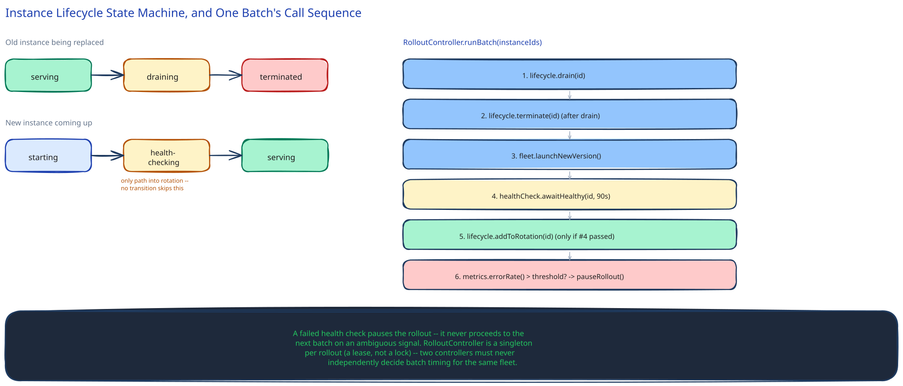

# Module 02 — Low-Level Design



## The two components worth opening up

Everything else in module 01 is "call a load balancer" or "run a health check." Two pieces have a real decision inside them worth designing at the class level: the **instance lifecycle state machine** (what state is a single instance in, at any moment, and what's allowed to move it between states) and the **batch-rollout controller** (how many instances to touch at once, and when to pause).

## Interfaces vs. implementations

- **`InstanceLifecycle`** *(interface)* → **`LBBackedInstanceLifecycle`** — `drain(instanceId)`, `terminate(instanceId)`, `awaitHealthy(instanceId)`. Hides whether "drain" means an LB API call, a Kubernetes pod eviction, or something else entirely.
- **`RolloutState`** *(interface)* → **`EtcdRolloutState`** — `recordBatch(batchId, instanceIds, status)`, `currentState()`. The durable record module 03 covers.
- **`HealthCheck`** *(interface)* → **`HttpHealthCheck`** — `isHealthy(instanceId)`, polled after an instance starts on the new version, before it's ever added back to rotation.
- **`RolloutController`** — the orchestrator. Depends on all three interfaces, implements none of the actual draining/health-checking itself — same repository-pattern discipline this guide uses everywhere else.

Naming the patterns: `InstanceLifecycle` and `RolloutState` are the **Repository** pattern again. The decision of "is the current error rate low enough to continue" is a **Strategy** — a simple fixed threshold today, swappable later for something more adaptive without touching the controller.

## The instance state machine

Every instance is, at any moment, in exactly one of: `serving` -> `draining` -> `terminated` (old instance being replaced), or `starting` -> `health-checking` -> `serving` (new instance coming up). The state machine is the actual safety mechanism: an instance is only ever added to load-balancer rotation from the `serving` state, and there is no transition that skips `health-checking` — a new instance can never receive live traffic before proving itself, and an old instance can never be terminated before finishing `draining`.

## Pseudocode for one batch

```
Controller.runBatch(instanceIds):
    for id in instanceIds:
        lifecycle.drain(id)                      # removes from LB rotation, starts drain timer

    for id in instanceIds:
        lifecycle.terminate(id)                  # only after drain completes or times out
        newId = fleet.launchNewVersion()
        rolloutState.recordBatch(batchId, newId, status="starting")

    for id in newInstanceIds:
        healthy = healthCheck.awaitHealthy(id, timeout=90s)
        if not healthy:
            controller.pauseRollout(reason="new instance failed health check")
            return

    for id in newInstanceIds:
        lifecycle.addToRotation(id)              # only reachable after a passed health check
        rolloutState.recordBatch(batchId, id, status="serving")

    if metrics.errorRate() > threshold:
        controller.pauseRollout(reason="elevated error rate")
```

Two error cases worth designing for deliberately:

- **A new instance never becomes healthy:** the controller does not proceed to the next batch — it pauses and surfaces the failure, rather than silently retrying forever or continuing past a batch it can't confirm is safe. Treating "unhealthy" and "still starting" as the same non-signal would be the mistake; the timeout is what turns an ambiguous wait into a decision.
- **The drain timer expires with a request still in flight:** the instance is terminated anyway rather than waiting indefinitely — named explicitly in module 01's trade-offs as a deliberate, bounded risk, not an oversight.

## Concurrency, at the code level

`RolloutController` itself is a singleton per rollout — exactly one instance of it drives a given deploy, which is a genuine, deliberate exception to "everything in this guide is stateless and horizontally scaled": having two controllers independently decide batch timing for the same fleet is the actual hazard here, not a race worth resolving with a lock. In practice this is enforced the same way this guide's [Distributed Locks](../content/scalability-resilience/distributed-locks.md) page describes — a single active controller holds a lease, and a standby can take over only if that lease expires, rather than two controllers ever running against the same rollout simultaneously.

Within one batch, though, the per-instance operations (`drain`, `terminate`, health checks) are independent and safely parallel — nothing about one instance's lifecycle transition depends on another instance's, which is exactly why batching (rather than one-at-a-time) is safe to do at all.

## Practice: extend it yourself

Before moving to module 03, sketch how you'd add:

1. **Progressive batch sizing** (start at 1%, double after each clean batch) — does this state live in `RolloutController`, or does it need its own small component?
2. **Automatic rollback on a failed health check**, rather than just pausing — which interface needs a new method, and what does "rollback" actually mean for a batch that's only half-replaced?

Neither has one right answer — the point is noticing the interface boundaries already drawn make it obvious where each change would go.
