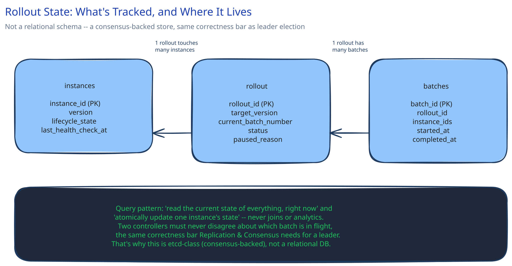

# Module 03 — Database Design

## Not every system in this guide has a conventional schema

The other worked examples in this project have an obvious set of entities — users, posts, orders. This one doesn't have a "database" in that sense at all: nothing here is user-facing data. What genuinely needs to be tracked and persisted is the **rollout's own state** — which instances exist, what version each one is on, and where the rollout currently stands — so that a controller crash (module 02) doesn't lose track of an in-progress deploy.

## The state that actually needs to persist

- **`instances`** — `instance_id`, `version`, `lifecycle_state` (serving / draining / starting / health-checking / terminated), `last_health_check_at`.
- **`rollout`** — `rollout_id`, `target_version`, `current_batch_number`, `status` (running / paused / rolled_back / complete), `paused_reason` (nullable).
- **`batches`** — `batch_id`, `rollout_id`, `instance_ids` (the specific instances this batch touched), `started_at`, `completed_at`.

## Why this lives in a coordination store, not a relational database

The query pattern here is almost entirely "read the current state of everything, right now" and "atomically update one instance's state" — not joins, not analytics, not historical reporting. More importantly, this state has the same correctness requirement this guide's [Replication & Consensus](../content/hld-building-blocks/replication-consensus.md) page describes for "who is the leader right now": two controllers must never disagree about which batch is currently in flight, the same way two nodes must never both believe they're the leader. That's why real systems (Kubernetes' etcd, or an equivalent) use a **consensus-backed** store for exactly this state — strongly consistent, and built specifically to make "exactly one writer, and every reader agrees on the current value" hold under a crash, rather than a general-purpose relational database bolted on after the fact.

## Indexes and access patterns

- `instances` keyed by `instance_id` — the only lookup this table ever serves is "what's this instance's current state," a point read.
- `rollout` is effectively a single row per active deploy — there's no secondary index question here at all; the entire point is that any reader gets the one current value, not a query across many rows.
- `batches` keyed by `rollout_id` for "what batches has this rollout run so far" — used for the rollback path in module 01, which replays completed batches in reverse.

## Consistency

- **Strongly consistent, by requirement, not by default.** A controller that reads a stale `lifecycle_state` for an instance could add an unhealthy instance back into rotation, or terminate one that's still draining — this is exactly the class of bug this guide's [ACID vs BASE](../content/database-design/acid-vs-base.md) page frames as needing the stronger guarantee, not the weaker one. There's no "eventually consistent" version of this state that's safe.

## Scaling the schema

- This state is small by construction — even a 100,000-instance fleet is 100,000 rows in `instances`, nothing that stresses a consensus store's typical scale. The load-bearing requirement here is correctness under a crash, not throughput; this table was never going to be the bottleneck in this system, and sharding it would add coordination complexity to solve a scaling problem this system doesn't actually have.

## Connecting it back

Module 01's per-instance lifecycle states are exactly the `lifecycle_state` column here; module 02's `RolloutState` interface is the repository sitting in front of this exact table set. The chain holds the same way it does in this project's other worked examples — a requirement (the controller must survive a crash without losing track of the rollout) is why this state is durable at all, and *what* had to be strongly consistent (module 01's "never route to an unhealthy instance") is why a consensus-backed store, not a relational one, is the right tool here.
